# **KS0526 Keyestudio Mini Tank Robot V3**


# **Прочитайте мене спочатку**

**Завантажте додаток, код та бібліотеку за посиланням: <https://fs.keyestudio.com/KS0526>**

# **1. Вступ**

Цей STEM освітній танковий робот V3.0 новітньої версії, який було оновлено, додавши функції слідування за лінією та гасіння вогню. Він значно покращує взаємозв'язок між дітьми та батьками і розпалює уяву дітей через програмування та кодування. У процесі складання ви можете побачити його численні функції, такі як слідування за світлом, слідування за лінією, ІЧ та Bluetooth дистанційне керування, регулювання швидкості тощо. Крім того, є деякі дрібні деталі, які допоможуть вам зібрати робота. Включені основні датчики та модулі, такі як датчик полум'я, Bluetooth датчик, датчик уникнення перешкод, датчик слідування за лінією та ультразвуковий датчик. Два підручники з мови C та Arduino також підходять для ентузіастів різного віку. Це дійсно найкращий вибір для вас.

# **2. Особливості:**

1. Багатофункціональність: обмеження, слідування за лінією, гасіння вогню, слідування за світлом, ІЧ та Bluetooth дистанційне керування, контроль швидкості тощо.
2. Легкість у складанні: зібрати робота з дрібних деталей.
3. Висока міцність: кронштейни з алюмінієвого сплаву, металеві мотори, високоякісні колеса.
4. Висока розширюваність: підключення багатьох датчиків та модулів через моторний драйверний щит та щит датчиків.
5. Багатоканальне керування: ІЧ дистанційне керування, керування через додаток (iOS та Android системи).
6. Основне програмування: код на мові C для Arduino IDE.

# **3. Параметри:**

Робоча напруга: 5V
Вхідна напруга: 7-12V
Максимальний вихідний струм: 2A
Максимальна потужність розсіювання: 25W (T=75℃)
Швидкість мотора: 5V 200 об/хв
Режим керування мотором: подвійний H міст (L298P)
Кут ультразвукової індукції: \<15 градусів
Діапазон виявлення ультразвуку: 2см-300см
Дистанція ІЧ дистанційного керування: 10 метрів (виміряно)
Дистанція Bluetooth дистанційного керування: 30 метрів (виміряно)

# **4. Список комплекту**

<table>
<tbody>
<tr class="odd">
<td>#</td>
<td>Зображення</td>
<td>Назва</td>
<td>Кількість</td>
</tr>
<tr class="even">
<td>1</td>
<td>

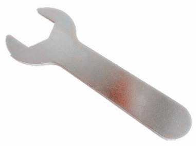

</td>
<td>Ключ</td>
<td>1</td>
</tr>
<tr class="odd">
<td>2</td>
<td>

 </td>

<td>Ведучі колеса</td>
<td>2</td>
</tr>
<tr class="even">
<td>3</td>
<td>

 </td>

<td>Гвинти з шестигранною головкою M4*12мм</td>
<td>2</td>
</tr>
<tr class="odd">
<td>4</td>
<td>

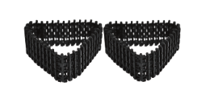 </td>

<td>Гусениця</td>
<td>2</td>
</tr>
<tr class="even">
<td>5</td>
<td> </td>
<td>Ведене колесо</td>
<td>2</td>
</tr>
<tr class="odd">
<td>6</td>
<td> </td>
<td>Гвинти з шестигранною головкою M4*35мм</td>
<td>2</td>
</tr>
<tr class="even">
<td>7</td>
<td>  </td>
<td>Нижні частини</td>
<td>1</td>
</tr>
<tr class="odd">
<td>8</td>
<td> </td>
<td>Keyestudio V4.0 плата розробки</td>
<td>1</td>
</tr>
<tr class="even">
<td>9</td>
<td> 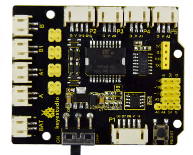</td>
<td>L298P моторний драйверний щит</td>
<td>1</td>
</tr>
<tr class="odd">
<td>10</td>
<td> </td>
<td>Keyestudio HM-10 Bluetooth-4.0</td>
<td>1</td>
</tr>
<tr class="even">
<td>11</td>
<td> </td>
<td>HC-SR04 ультразвуковий датчик</td>
<td>1</td>
</tr>
<tr class="odd">
<td>12</td>
<td> </td>
<td>Keyestudio 8*16 LED панель</td>
<td>1</td>
</tr>
<tr class="even">
<td>13</td>
<td> </td>
<td>Жовтий LED модуль</td>
<td>1</td>
</tr>
<tr class="odd">
<td>14</td>
<td> </td>
<td>Датчик полум'я</td>
<td>2</td>
</tr>
<tr class="even">
<td>15</td>
<td> </td>
<td>130 моторний модуль</td>
<td>1</td>
</tr>
<tr class="odd">
<td>16</td>
<td> 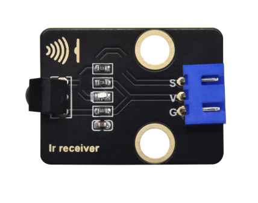</td>
<td>ІЧ приймач модуль</td>
<td>1</td>
</tr>
<tr class="even">
<td>17</td>
<td> 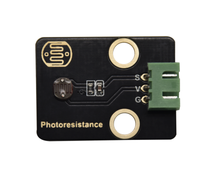</td>
<td>Фоторезистор</td>
<td>2</td>
</tr>
<tr class="odd">
<td>18</td>
<td> </td>
<td><p>Акрилова плата для</p> <p>8*16 LED панелі</p></td>
<td>1</td>
</tr>
<tr class="even">
<td>19</td>
```html
<td> </td> <td>Upper Board</td> <td>1</td> </tr> <tr class="odd"> <td>20</td> <td>  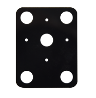</td> <td>Acrylic Board</td> <td>2</td> </tr> <tr class="even"> <td>21</td> <td> </td> <td><p>Keyestudio JMFP-4 17-Key</p> <p>Remote Control</p> <p>(Without Batteries)</p></td> <td>1</td> </tr> <tr class="odd"> <td>22</td> <td> </td> <td>Keyestudio 9G 180 °Servo</td> <td>1</td> </tr> <tr class="even"> <td>23</td> <td> </td> <td>USB Cable</td> <td>1</td> </tr> <tr class="odd"> <td>24</td> <td> </td> <td>3.0*40MM Screwdriver</td> <td>1</td> </tr> <tr class="even"> <td>25</td> <td> </td> <td><p>4P M-F PH2.0mm to 2.54 Dupont Wire</p> <p>(Green-Blue-Red-Black)</p></td> <td>1</td> </tr> <tr class="odd"> <td>26</td> <td> </td> <td>4P HX-2.54 Dupont Wire (Black-Red-White-Brown)</td> <td>1</td> </tr> <tr class="even"> <td>27</td> <td> </td> <td>5P JST-PH2.0MM Dupont Wire</td> <td>1</td> </tr> <tr class="odd"> <td>28</td> <td> </td> <td>3P-3P XH2.54 to 2.54 Dupont Wire（Yellow-Red-Black)</td> <td>1</td> </tr> <tr class="even"> <td>29</td> <td> </td> <td>3P-3P XH2.54 to PH2.0 Dupont Wire（Yellow-Red-Black)</td> <td>3</td> </tr> <tr class="odd"> <td>30</td> <td> </td> <td>4P-3P XH2.54 to PH2.0 Dupont Wire（Yellow-Red-Black)</td> <td>2</td> </tr> <tr class="even"> <td>31</td> <td> </td> <td><p>4P XH2.54 to PH2.0</p> <p>Dupont Wire（Green-Blue-Red-Black)</p></td> <td>1</td> </tr> <tr class="odd"> <td>32</td> <td> </td> <td>M1.4*8MM Round-head Screws</td> <td>6</td> </tr> <tr class="even"> <td>33</td> <td> </td> <td>M1.4 Nuts</td> <td>6</td> </tr> <tr class="odd"> <td>34</td> <td> </td> <td>M2 Nuts</td> <td>8</td> </tr> <tr class="even"> <td>35</td> <td> </td> <td>M2*8MM Round-head Screws</td> <td>8</td> </tr> <tr class="odd"> <td>36</td> <td> </td> <td>M1.2*5MM Round-head Screws</td> <td>6</td> </tr> <tr class="even"> <td>37</td> <td> </td> <td>M3*6MM Round-head Screws</td> <td>18</td> </tr> <tr class="odd"> <td>38</td> <td> </td> <td>M3*10MM Round-head Screws</td> <td>3</td> </tr> <tr class="even"> <td>39</td> <td> </td> <td>M3 Nuts</td> <td>3</td> </tr> <tr class="odd"> <td>40</td> <td> </td> <td>M3*10MM Dual-pass Copper Pillar</td> <td>4</td> </tr> <tr class="even"> <td>41</td> <td> </td> <td>M3*40MM Dual-pass Copper Pillar</td> <td>4</td> </tr> <tr class="odd"> <td>42</td> <td> </td> <td>43093 Blue Technic Axle Pin with Friction Ridges</td> <td>13</td> </tr> <tr class="even"> <td>43</td> <td> </td> <td>4265c Technic Bush</td> <td>13</td> </tr> <tr class="odd"> <td>44</td> <td> </td> <td>Winding Pipe</td> <td>.12</td> </tr> <tr class="even"> <td>45</td> <td> </td> <td>3*100MM Ties</td> <td>5</td> </tr> <tr class="odd"> <td>46</td> <td> </td> <td>L Type M2.5 Wrench</td> <td>1</td> </tr> <tr class="even"> <td>47</td> <td> </td> <td>L Type M3 Wrench</td> <td>1</td> </tr> <tr class="odd"> <td>48</td> <td> </td> <td>L Type M1.5 Wrench</td> <td>1</td>
```
</tr> <tr class="even"> <td>49</td> <td> </td> <td>Cardboard</td> <td>1</td> </tr> </tbody> </table> # **5. Встановлення Arduino IDE та драйвера** **Keyestudio V4.0 Development Board** Ви повинні знати, що плата розробки Keyestudio V4.0 є основою цього розумного автомобіля.  Плата розробки Keyestudio V4.0 базується на мікроконтролері ATmega328P та має чіп CP2102 як перетворювач UART-to-USB.  Вона має 14 цифрових входів/виходів (з яких 6 можуть використовуватися як PWM виходи), 6 аналогових входів, кварцовий кристал на 16 МГц, USB-з'єднання, роз'єм живлення, 2 ICSP заголовки та кнопку скидання.  Ми можемо живити її за допомогою USB-кабелю, зовнішнього роз'єму живлення постійного струму (DC 7-12V) або жіночих заголовків Vin/GND (DC 7-12V). <table> <tbody> <tr class="odd"> <td>Мікроконтролер</td> <td>ATmega328P-PU</td> </tr> <tr class="even"> <td>Робоча напруга</td> <td>5V</td> </tr> <tr class="odd"> <td>Вхідна напруга (рекомендована)</td> <td>DC7-12V</td> </tr> <tr class="even"> <td>Цифрові I/O піни</td> <td><p>14 (D0-D13)</p> <p>(з яких 6 забезпечують PWM вихід)</p></td> </tr> <tr class="odd"> <td>PWM цифрові I/O піни</td> <td>6 (D3, D5, D6, D9, D10, D11)</td> </tr> <tr class="even"> <td>Аналогові входи</td> <td>6 (A0-A5)</td> </tr> <tr class="odd"> <td>Постійний струм на I/O пін</td> <td>20 мА</td> </tr> <tr class="even"> <td>Постійний струм для 3.3V піну</td> <td>50 мА</td> </tr> <tr class="odd"> <td>Flash пам'ять</td> <td>32 KB (ATmega328P-PU), з яких 0.5 KB використовується завантажувачем</td> </tr> <tr class="even"> <td>SRAM</td> <td>2 KB (ATmega328P-PU)</td> </tr> <tr class="odd"> <td>EEPROM</td> <td>1 KB (ATmega328P-PU)</td> </tr> <tr class="even"> <td>Швидкість годинника</td> <td>16 МГц</td> </tr> <tr class="odd"> <td>LED_BUILTIN</td> <td>D13</td> </tr> </tbody> </table> **Встановлення Arduino IDE**  **Натисніть на посилання, щоб почати вивчати, як завантажити програмне забезпечення, встановити драйвери, завантажити код та встановити бібліотечні файли.** **[https://getting-started-with-arduino.readthedocs.io](https://getting-started-with-arduino.readthedocs.io/en/latest/Arduino%20IDE%20Tutorial.html)** # **6. Проекти** Примітка: (G), позначений на кожному датчику та модулі, є негативним полюсом і підключається до "G", "-" або "GND" на щиті датчика або контрольній платі; (V) є позитивним полюсом і підключається до V, VCC, + або 5V на щиті датчика або контрольній платі. ## **Проект 1: Миготіння світлодіода** (1) Опис:  Для початківців та ентузіастів програма миготіння світлодіода є основною. Світлодіод, абревіатура від light emitting diodes, складається з хімічних сполук Ga, As, P, N тощо. Світлодіод може миготіти різними кольорами, змінюючи час затримки в тестовому коді. При керуванні, підключивши GND та VCC, світлодіод буде увімкнений, якщо кінець S знаходиться на високому рівні; в іншому випадку він буде вимкнений.  (2) Параметри: Інтерфейс керування: цифровий порт Робоча напруга: DC 3.3-5V Відстань між пінів: 2.54 мм Колір світлодіодного дисплея: жовтий (3) Необхідні компоненти: | Keyestudio V4.0 Development Board *1 | L298P Motor Driver Shield*1 | Жовтий світлодіодний модуль*1 | | --------------------------------------------------- | --------------------------- | -------------------- | |  |  |  | | 3P-3P XH2.54 до 2.54 Dupont Wire (Жовтий-Червоний-Чорний) | USB-кабель*1 | | |  |  | | (4) Щит керування мотором V2: Існує багато способів керування мотором. Наш робот використовує найпоширеніше рішення - L298P, який є відмінним високопотужним драйвером моторів, виробленим STMicroelectronics. Він може безпосередньо керувати двигунами постійного струму, двофазними та чотирифазними кроковими двигунами. Струм керування досягає 2А, а вихідний термінал двигуна використовує вісім високошвидкісних діодів Шотткі для захисту. Ми розробили щит на основі схеми L298P. Конструкція з накладками знижує технічну складність використання та керування мотором.  (5) Схема підключення:  Світлодіод підключений до порту D3, і не забудьте встановити перемички на щит (6) Тестовий код: ```c++ /* keyestudio Mini Tank Robot V3 lesson 1.1 Blink http://www.keyestudio.com */ int LED = 3; //Визначити пін світлодіода для підключення до цифрового порту 3 void setup() { pinMode(LED, OUTPUT); //Ініціалізувати пін світлодіода в режим виводу } void loop() //Створити нескінченний цикл { digitalWrite(LED, HIGH); //Вивести високий рівень і увімкнути світлодіод delay(1000); //Зачекати
```c++
for 1s digitalWrite(LED, LOW); //Output low level and turn on LED delay(1000); //Wait for 1s } ``` (7) Результати тесту: Завантажте програму, LED блимає з інтервалом 1s. (8) Пояснення коду: **pinMode(LED，OUTPUT) -** Ця функція може позначати, що пін є INPUT або OUTPUT **digitalWrite(LED，HIGH) -** Коли пін є OUTPUT, ми можемо встановити його на HIGH (вихід 5V) або LOW (вихід 0V) (9) Розширена практика: Ми успішно змусили LED блимати. Тепер давайте подивимося, що станеться з LED, якщо ми змінимо піни та час затримки. ```c++ /* keyestudio Mini Tank Robot V3 урок 1.2 Блимання http://www.keyestudio.com */ int LED = 3; //Визначаємо пін LED для підключення до цифрового порту 3 void setup() { pinMode(LED, OUTPUT); //Ініціалізуємо пін LED у режим виходу } void loop() //Формуємо нескінченний цикл { digitalWrite(LED, HIGH); //Вихід високого рівня та увімкнення LED delay(100); //Чекаємо 0.1s digitalWrite(LED, LOW); //Вихід низького рівня та увімкнення LED delay(100); //Чекаємо 0.1s } ``` Результати тесту показують, що LED блимає швидше. Отже, ми можемо зробити висновок, що піни та час затримки впливають на частоту блимання. ## **Проект 2: Регулювання яскравості LED** 1. Опис: У попередньому уроці ми керували увімкненням та вимкненням LED і змусили його блимати. У цьому проекті ми будемо керувати яскравістю LED через PWM, імітуючи ефект дихання. Аналогічно, ви можете змінити довжину кроку та час затримки в коді, щоб продемонструвати різні ефекти дихання. PWM - це спосіб керування аналоговим виходом за допомогою цифрових засобів. Цифрове керування використовується для генерації квадратних хвиль з різними робочими циклами (сигнал, який постійно перемикається між високим і низьким рівнями) для керування аналоговим виходом. Загалом, вхідні напруги портів становлять 0V і 5V. Що робити, якщо потрібна напруга 3V? Або перемикання між 1V, 3V і 3.5V? Ми не можемо постійно змінювати резистори. З цієї причини ми звертаємося до PWM.  Для виходів цифрових портів Arduino є лише рівні LOW і HIGH, які відповідають вихідним напругам 0V і 5V відповідно. Ви можете визначити LOW як "0", а HIGH як "1", і дозволити Arduino вивести п'ятсот "0" або "1" протягом 1 секунди. Якщо вивести п'ятсот "1", це буде 5V; якщо всі вони "0", це буде 0V; якщо вивести 25001 шаблон, це буде 2.5V. Цей процес можна порівняти з показом фільму. Фільми, які ми дивимося, не є повністю безперервними. Насправді, вони генерують 25 зображень за секунду, що не може бути помічено людським оком. Тому ми помилково сприймаємо це як безперервний процес. PWM працює таким же чином. Щоб вивести різні напруги, нам потрібно контролювати співвідношення 0 і 1. Чим більше "0" або "1" виводиться за одиницю часу, тим точніше керування. 2. Параметри:  Інтерфейс керування: Цифровий порт 3 Робоча напруга: DC 3.3-5V Відстань між пінів: 2.54mm Колір дисплея LED: жовтий 3. Необхідні компоненти: | Keyestudio V4.0 Development Board *1 | L298P Motor Driver Shield*1 | Yellow LED Module*1 | | --------------------------------------------------- | --------------------------- | -------------------- | |  |  |  | | 3P-3P XH2.54 to 2.54 Dupont Wire (Yellow-Red-Black) | USB Cable*1 | | |  |  | | 4) Схема підключення:  5. Тестовий код: ```c++ /* keyestudio Mini Tank Robot V3 урок 2.1 pwm http://www.keyestudio.com */ int LED = 3; //Визначаємо пін LED для підключення до цифрового порту 3 void setup () { pinMode (LED, OUTPUT); //Ініціалізуємо пін LED у режим виходу } void loop () { for (int value = 0; value < 255; value = value + 1) { analogWrite (LED, value); // LED вмикається delay (5); // Затримка 5ms } for (int value = 255; value > 0; value = value - 1) { analogWrite (LED, value); // LED вимикається delay (5); // Затримка 5ms } } ``` 6) Результати тесту: Успішно завантажте тестовий код, LED поступово змінюється від яскравого до темного, як людське дихання, а не вмикається і вимикається миттєво. 7) Пояснення коду: Щоб повторити деякі певні оператори, ми можемо використовувати оператор FOR. Формат оператора FOR показаний нижче:  Послідовність циклу FOR: Раунд 1: 1 → 2 → 3 → 4 Раунд 2: 2 → 3 → 4 ... Поки число 2 не встановлено, цикл "for" закінчується. Після знання цього порядку, поверніться до коду: **for (int value = 0; value < 255; value=value+1){** ​ **...}** **for (int value = 255; value >0; value=value-1){** ​ **...}** Два оператори "for" змушують значення збільшуватися від 0 до 255, потім зменшуватися від 255 до 0, потім знову збільшуватися до 255, ... нескінченний цикл. У наступному коді є нова функція ----- analogWrite() Ми знаємо, що цифровий порт має лише два стани: 0 і 1. Тож як відправити аналогове значення до цифрового значення? Ось як це зробити.
```
function is needed. Let’s observe the Arduino board and find 6 pins marked “\~” which can output PWM signals. Function format as follows: **analogWrite(pin,value)** analogWrite() is used to write an analog value from 0\~255 for PWM port, so the value is in the range of 0\~255. Attention that you only write the digital pins with PWM function, such as pin 3, 5, 6, 9, 10, 11. PWM is a technology to obtain analog quantity through digital method. Digital control forms a square wave, and the square wave signal only has two states of turning on and off (that is, high or low levels). By controlling the ratio of the duration of turning on and off, a voltage varying from 0 to 5V can be simulated. The time turning on (academically referred to as high level) is called pulse width, so PWM is also called pulse width modulation. Through the following five square waves, let’s acknowledge more about PWM.  In the above figure, the green line represents a period, and value of analogWrite() corresponds to a percentage which is called Duty Cycle as well. Duty cycle implies that high-level duration is divided by low-level duration in a cycle. From top to bottom, the duty cycle of first square wave is 0% and its corresponding value is 0. The LED brightness is lowest, that is, light off. The more time the high level lasts, the brighter the LED. Therefore, the last duty cycle is 100%, which correspond to 255, and LED is the brightest. And 25% means darker. PWM mostly is used for adjusting the LED’s brightness or the rotation speed of motors. It plays a vital role in controlling smart robot cars. I believe that you cannot wait to learn next project. 8. Extension Practice： Let’s modify the value of delay and remain the pin unchanged, then observe how LED changes. ```c++ /* keyestudio Mini Tank Robot V3 lesson 2.2 pwm-slow http://www.keyestudio.com */ int LED = 3; //Define the pin of LED to connect with digital port 3 void setup () { pinMode (LED, OUTPUT); //Initialize the LED pin to output mode } void loop () { for (int value = 0; value < 255; value = value + 1) { analogWrite (LED, value); // LED turns on delay (30); // Delay in 30ms } for (int value = 255; value > 0; value = value - 1) { analogWrite (LED, value); // LED turns off delay (30); // Delay in 30ms } } ``` Upload the code to development board, LED flashes more slowly. ## **Project 3: Photoresistor**  1. Description： The photosensitive resistor is a special resistor made of a semiconductor material such as a sulfide or selenium, and a moisture-proof resin is also coated with a photoconductive effect. The photosensitive resistance is most sensitive to the ambient light, different illumination strength, and the resistance of the photosensitive resistance is different. We use the photosensitive resistance to design the photosensitive resistor module. The module signal is connected to the microcontroller analog port. When the light intensity is stronger, the larger the analog port voltage, that is, the simulation value of the microcontroller is also large; in turn, when the light intensity is weaker, the smaller the analog port voltage, that is, the simulation value of the microcontroller is also small. . In this way, we can read the corresponding analog value using the photosensitive resistor module, and the intensity of the light in the inductive environment. 2) Parameters：  Photosensitive resistance resistance value: 5K Ou-0.5m Interface type: simulation port A0, A1 Working voltage: 3.3V-5V Pin spacing: 2.54mm 3) Components Needed: | Keyestudio V4.0 Development Board *1 | L298P Motor Driver Shield*1 | Yellow LED Module*1 | 3P-3P XH2.54 to 2.54 Dupont Wire（Yellow-Red-Black)*1 | | -------------------------------------- | ------------------------------------------------------ | -------------------- | ----------------------------------------------------- | |  |  |  |  | | Photoresistor *1 | 3P-3P XH2.54 to PH2.0 Dupont Wire（Yellow-Red-Black)*1 | USB Cable*1 | | |  |  |  | | 4) Connection Diagram  We connect a photoresistor to A0 and make an experiment. Let’s read its analog value first. 5) Test Code： ```c++ /* keyestudio Mini Tank Robot V3 lesson 3.1 photocell http://www.keyestudio.com */ int sensorPin = A1; // A1 is the input pin of photoresistor int sensorValue = 0; // save the value of photoresistors void

Функція потрібна. Давайте розглянемо плату Arduino і знайдемо 6 контактів, позначених “\~”, які можуть виводити PWM сигнали. Формат функції наступний: **analogWrite(pin,value)** analogWrite() використовується для запису аналогового значення від 0\~255 для порту PWM, тому значення знаходиться в діапазоні від 0\~255. Зверніть увагу, що ви можете записувати тільки цифрові контакти з функцією PWM, такі як контакт 3, 5, 6, 9, 10, 11. PWM - це технологія отримання аналогової величини цифровим методом. Цифрове керування формує прямокутну хвилю, і сигнал прямокутної хвилі має лише два стани: увімкнено і вимкнено (тобто високий або низький рівень). Контролюючи співвідношення тривалості увімкнення і вимкнення, можна імітувати напругу від 0 до 5В. Час увімкнення (академічно називається високим рівнем) називається шириною імпульсу, тому PWM також називається широтно-імпульсною модуляцією. Через наступні п'ять прямокутних хвиль давайте дізнаємося більше про PWM.  На малюнку вище зелена лінія представляє період, а значення analogWrite() відповідає відсотку, який також називається робочим циклом. Робочий цикл означає, що тривалість високого рівня ділиться на тривалість низького рівня в циклі. Зверху вниз робочий цикл першої прямокутної хвилі становить 0%, і його відповідне значення - 0. Яскравість світлодіода найнижча, тобто світло вимкнено. Чим довше триває високий рівень, тим яскравіший світлодіод. Тому останній робочий цикл становить 100%, що відповідає 255, і світлодіод найяскравіший. А 25% означає темніше. PWM в основному використовується для регулювання яскравості світлодіодів або швидкості обертання двигунів. Він відіграє важливу роль у керуванні розумними роботизованими автомобілями. Вірю, що ви не можете дочекатися, щоб дізнатися про наступний проект. 8. Розширена практика: Давайте змінимо значення затримки і залишимо контакт незмінним, а потім спостерігатимемо, як змінюється світлодіод. `c++ /* keyestudio Mini Tank Robot V3 lesson 2.2 pwm-slow http://www.keyestudio.com */ int LED = 3; // Визначити контакт світлодіода для підключення до цифрового порту 3 void setup () { pinMode (LED, OUTPUT); // Ініціалізувати контакт світлодіода в режимі виходу } void loop () { for (int value = 0; value < 255; value = value + 1) { analogWrite (LED, value); // Світлодіод вмикається delay (30); // Затримка на 30мс } for (int value = 255; value > 0; value = value - 1) { analogWrite (LED, value); // Світлодіод вимикається delay (30); // Затримка на 30мс } }` Завантажте код на плату розробки, світлодіод блимає повільніше. ## **Проект 3: Фоторезистор**  1. Опис: Фоторезистор - це спеціальний резистор, виготовлений з напівпровідникового матеріалу, такого як сульфід або селен, і покритий вологостійкою смолою з фотопровідним ефектом. Фоторезистор найбільш чутливий до навколишнього світла, різної сили освітлення, і опір фоторезистора різний. Ми використовуємо фоторезистор для розробки модуля фоторезистора. Сигнал модуля підключається до аналогового порту мікроконтролера. Коли інтенсивність світла сильніша, більша напруга аналогового порту, тобто імітаційне значення мікроконтролера також велике; навпаки, коли інтенсивність світла слабша, напруга аналогового порту менша, тобто імітаційне значення мікроконтролера також мале. Таким чином, ми можемо зчитувати відповідне аналогове значення за допомогою модуля фоторезистора і інтенсивність світла в індуктивному середовищі. 2) Параметри:  Опір фоторезистора: 5K Ом-0.5M Тип інтерфейсу: аналоговий порт A0, A1 Робоча напруга: 3.3V-5V Відстань між контактами: 2.54mm 3) Необхідні компоненти: | Keyestudio V4.0 Development Board *1 | L298P Motor Driver Shield*1 | Yellow LED Module*1 | 3P-3P XH2.54 to 2.54 Dupont Wire (Yellow-Red-Black)*1 | | -------------------------------------- | ------------------------------------------------------ | -------------------- | ----------------------------------------------------- | |  |  |  |  | | Фоторезистор *1 | 3P-3P XH2.54 to PH2.0 Dupont Wire (Yellow-Red-Black)*1 | USB Cable*1 | | |  |  |  | | 4) Схема підключення  Ми підключаємо фоторезистор до A0 і проводимо експеримент. Давайте спочатку зчитаємо його аналогове значення. 5) Тестовий код: ```c++ /* keyestudio Mini Tank Robot V3 lesson 3.1 photocell <http://www.keyestudio.com> \*/ int sensorPin = A1; // A1 - вхідний контакт фоторезистора int sensorValue = 0; // зберегти значення фоторезисторів void

```c++
setup() {
  Serial.begin(9600); // Відкрийте монітор послідовного порту та встановіть швидкість передачі даних на 9600
}

void loop() {
  sensorValue = analogRead(sensorPin); // Зчитайте аналогове значення з фоторезистора
  Serial.println(sensorValue); // Послідовний порт друкує значення фоторезистора
  delay(500); // Затримка на 500 мс
}
```

6. Результати тесту:  
     
   При закритті значення зменшується; якщо не закривати, значення збільшується.

7. Пояснення коду:  
   **analogRead(sensorPin)：зчитування аналогового значення фоторезистора**  
   **Serial.begin(9600)：ініціалізація послідовного порту та встановлення швидкості передачі даних на 9600**  
   **Serial.println：**послідовний порт друкує

8. Додаткова практика:  
   Ми знаємо значення фоторезистора. Як щодо керування яскравістю світлодіода за допомогою нього?  
     
   Яскравість світлодіода контролюється за допомогою PWM. Тому ми підключаємо світлодіод до PMW піну (пін 3) на платі.

```c++
/* keyestudio Mini Tank Robot V3 урок 3.2 фоторезистор-аналоговий вихід http://www.keyestudio.com */
int analogInPin = A0; // A1 - вхідний пін фоторезистора
int analogOutPin = 3; // Цифровий порт 3 - вихід PMW
int sensorValue = 0; // збереження змінної значення опору фоторезистора
int outputValue = 0; // Значення виходу до PMW

void setup() {
  Serial.begin(9600); // Відкрийте монітор послідовного порту та встановіть швидкість передачі даних на 9600
}

void loop() {
  sensorValue = analogRead(analogInPin); // Зчитайте аналогове значення з фоторезистора
  // Перетворіть аналогові значення 0~1023 на значення виходу PWM 255~0
  outputValue = map(sensorValue, 0, 1023, 255, 0);
  // Змініть аналоговий вихід
  analogWrite(analogOutPin, outputValue);
  // Serial.println(sensorValue); // Послідовний порт друкує значення фоторезистора
  delay(2);
}
```

Завантажте код на плату розробки, потім закрийте фоторезистор і спостерігайте за яскравістю світлодіода.

## **Проект 4: Датчик лінійного слідування**

1. Опис:  
     
   Датчик слідування насправді є інфрачервоним датчиком. Компонент, що використовується тут, - це інфрачервона трубка TCRT5000. Принцип його роботи полягає у використанні різної відбивної здатності інфрачервоного світла до кольорів, а потім перетворенні сили відбитого сигналу в струмовий сигнал. Під час процесу виявлення чорний активується на високому рівні, а білий - на низькому рівні. Висота виявлення становить 0-3 см. Модуль лінійного слідування Keyestudio з 3 каналами інтегрує 3 набори інфрачервоних трубок TCRT5000 на одній платі, що робить зручнішим підключення та керування. Обертаючи регульований потенціометр на датчику, можна налаштувати чутливість виявлення датчика.

2) Параметри:  
   Робоча напруга: 3.3-5V (DC)  
   Інтерфейс: 5PIN  
   Вихідний сигнал: Цифровий сигнал  
   Висота виявлення: 0-3 см  
   Особлива примітка: перед тестуванням оберніть потенціометр на датчику, щоб налаштувати чутливість виявлення. Коли налаштувати світлодіод на порозі між ВКЛ і ВИКЛ, чутливість найкраща.

3) Необхідні компоненти:  
   | Keyestudio V4.0 Development Board *1 | L298P Motor Driver Shield | Yellow LED Module*1 | 3P-3P XH2.54 to 2.54 Dupont Wire（Yellow-Red-Black)*1 |  
   | ------------------------------------ | -------------------------------------- | -------------------- | ----------------------------------------------------- |  
   |  |  |  |  |  
   | Tank Robot Chassis *1 | 5P JST-PH2.0MM Dupont Wire*1 | USB Cable*1 |  
   |  |  |  |  
   | Примітка: датчик лінійного слідування встановлюється під дном робота.

4) Схема підключення:  
   

5) Тестовий код:

```c++
/* keyestudio Mini Tank Robot V3 урок 4.1 Датчик лінійного слідування http://www.keyestudio.com */
// Підключення датчиків лінійного слідування
#define L_pin 6 // для датчика зліва
#define M_pin 7 // для датчика посередині
#define R_pin 8 // для датчика справа

void setup() {
  Serial.begin(9600); // Встановіть швидкість передачі даних на 9600
  pinMode(L_pin, INPUT); // Встановіть всі піни датчиків лінійного слідування в режим входу
  pinMode(M_pin, INPUT);
  pinMode(R_pin, INPUT);
}

void loop () {
  int L_val = digitalRead(L_pin); // Зчитайте значення з лівого датчика
  int M_val = digitalRead(M_pin); // Зчитайте значення з середнього датчика
  int R_val = digitalRead(R_pin); // Зчитайте значення з правого датчика
  Serial.print(L_val);
  Serial.print(" ");
  Serial.print(M_val);
  Serial.print(" ");
  Serial.print(R_val);
  Serial.println(" ");
  delay(100); // затримка на 100 мс
}
```

6. Результати тесту:  
   Завантажте код на плату розробки, відкрийте серійний монітор для перевірки датчиків лінійного слідування. І відображене значення є...
   1 (високий рівень) коли сигнали не отримуються. Значення змінюється на 0, коли сенсор закритий папером. 

7. Пояснення коду: **Serial.begin(9600)** - Ініціалізує серійний порт, встановлює швидкість передачі даних на 9600 **pinMode-** Визначає режим роботи піна як вхідний або вихідний **digitalRead-** Зчитує стан піна, який зазвичай є високим (HIGH) або низьким (LOW) рівнем

8) Додаткова практика: Після розуміння принципу роботи, ви можете підключити світлодіод до D3, щоб керувати ним за допомогою сенсора лінійного відстеження. 

```c++
/* keyestudio Mini Tank Robot V3 урок 4.2 Сенсор лінійного відстеження http://www.keyestudio.com */
//LED пін
#define LED 3
//Підключення сенсорів лінійного відстеження
#define L_pin 6 //для сенсора зліва
#define M_pin 7 //для сенсора посередині
#define R_pin 8 //для сенсора справа

void setup() {
    Serial.begin(9600); //Встановлює швидкість передачі даних на 9600
    pinMode(LED, OUTPUT); //Встановлює LED як вихід
    pinMode(L_pin, INPUT); //Встановлює всі піни сенсорів лінійного відстеження як вхідні
    pinMode(M_pin, INPUT);
    pinMode(R_pin, INPUT);
}

void loop() {
    int L_val = digitalRead(L_pin); //Зчитує значення лівого сенсора
    int M_val = digitalRead(M_pin); //Зчитує значення середнього сенсора
    int R_val = digitalRead(R_pin); //Зчитує значення правого сенсора
    Serial.print(L_val);
    Serial.print(" ");
    Serial.print(M_val);
    Serial.print(" ");
    Serial.print(R_val);
    Serial.println(" ");
    delay(100); //Затримка на 100 мс
    if (L_val == 0 || M_val == 0 || R_val == 0) {
        digitalWrite(LED, HIGH);
    } else {
        digitalWrite(LED, LOW);
    }
}
```

## **Проект 5: Сенсор полум'я**


1. Опис: Сенсор полум'я використовує ІЧ-приймач для виявлення полум'я, перетворює яскравість полум'я в сигнали з високим і низьким рівнями, вводить їх у центральний процесор. Відповідна обробка програми. У випадках, коли полум'я є близьким або відсутнім, значення напруги аналогового порту змінюється. Якщо полум'я немає, аналоговий порт має приблизно 0.3В; коли є полум'я, аналоговий порт має 1.0В. Чим ближче полум'я, тим більше значення напруги. Це можна використовувати для виявлення джерела вогню або створення розумного робота. Зверніть увагу, що зонд сенсора полум'я витримує температуру від -25 ℃ до ～85℃. Під час використання звертайте увагу на те, щоб тримати сенсор полум'я на певній відстані, щоб уникнути пошкодження.

2. Параметри:
   
   Робоча напруга: 3.3В-5В (DC)
   Струм: 100мА
   Максимальна потужність: 0.5Вт
   Робоча температура: -10 °C до +50 °C
   Розмір сенсора: 31.6мм x 23.7мм
   Інтерфейс: 4pin перехід на 3PIN інтерфейс
   Вихідний сигнал: аналогові сигнали A0, A1

3. Необхідні компоненти:
   | Keyestudio V4.0 Development Board *1 | L298P Motor Driver Shield | Жовтий модуль LED*1 | 3P-3P XH2.54 до 2.54 Dupont Wire (Жовтий-Червоний-Чорний)*1 |
   | -------------------------------------- | ----------------------------------------------------- | -------------------- | ----------------------------------------------------- |
   |  |  |  |  |
   | Сенсор полум'я*1 | 4P-3P XH2.54 до PH2.0 Dupont Wire (Жовтий-Червоний-Чорний) | USB кабель\*1 | |
   |  |  |  | |

4. Схема підключення:
   
   Ми можемо використовувати два сенсори полум'я для створення робота, що гасить вогонь. Але в цьому експерименті ми прагнемо зчитувати його аналогове значення.

5. Тестовий код:

```c++
/* keyestudio Mini Tank Robot V3 урок 5.1 сенсор полум'я http://www.keyestudio.com */
int flame = A1; //Визначаємо пін сенсора полум'я як аналоговий пін A1
int val = 0; //Визначаємо цифрові змінні

void setup() {
    pinMode(flame, INPUT); //Визначаємо сенсор як вхідний
    Serial.begin(9600); //Встановлюємо швидкість передачі даних на 9600
}

void loop() {
    val = analogRead(flame); //Зчитуємо аналогове значення сенсора полум'я
    Serial.println(val); //Виводимо аналогове значення і друкуємо його
    delay(100); //Затримка на 100 мс
}
```

6. Результат тесту: Підключіть компоненти, завантажте код, відкрийте серійний монітор і встановіть швидкість передачі даних на 9600. Ви зможете побачити симуляційне значення сенсора полум'я. Чим ближче полум'я, тим менше симуляційне значення. Налаштуйте потенціометр на модулі, щоб підтримувати D1 на критичній точці. Коли сенсор не виявляє полум'я, D1 буде вимкнений, але якщо сенсор виявляє полум'я, D1 буде увімкнений. 

7. Додаткова практика: Далі підключіть світлодіод до піна 3, і ми зможемо керувати ним за допомогою сенсора полум'я, як показано нижче; 

```c++
/* keyestudio Mini Tank Robot V3 урок 5.2 сенсор полум'я
```

<http://www.keyestudio.com> */ int flame = A0; //Визначити пін полум'я як аналоговий пін A0 int LED = 3; //Визначити LED як цифровий порт 3 int val = 0; //Визначити цифрові змінні void setup() { pinMode(flame, INPUT); //Визначити пін полум'я як вхід pinMode(LED, OUTPUT); //Встановити LED в режим виходу Serial.begin(9600); //Встановити швидкість передачі даних на 9600 } void loop() { val = analogRead(flame); //Зчитати аналогове значення сенсора полум'я Serial.println(val);//Вивести аналогове значення та надрукувати його if (val < 300) { //Коли аналогове значення менше 300, LED вмикається digitalWrite(LED, HIGH); //LED вмикається } else { digitalWrite(LED, LOW); //LED вимикається } delay(50); //Затримка на 50мс } ``` ## **Проект 6: Вентилятор** 1. Опис：  Цей модуль вентилятора використовує чіп для керування мотором HR1124S, одно-канальний драйвер H-мосту, що містить PMOS та NMOS силові транзистори з низьким опором провідності. Низький опір провідності знижує споживання енергії, що сприяє безпечній роботі чіпа протягом тривалого часу. Крім того, його низький струм у режимі очікування та низький статичний робочий струм роблять його придатним для іграшок. Ми можемо керувати напрямком обертання та швидкістю вентилятора, подаючи сигнали IN+ та IN- і сигнали PWM. 2. Параметри： Робоча напруга: 5V Струм: 200mA Максимальна потужність: 2W Робоча температура: -10 °C до +50 градусів Цельсія Розмір: 47.6мм \* 23.8мм 3. Необхідні компоненти: | Keyestudio V4.0 Development Board *1 | L298P Motor Driver Shield | 130 Motor *1 | 4P XH2.54 to PH2.0 Dupont Wire (Зелений-Синій-Червоний-Чорний) *1 | | -------------------------------------- | ----------------------------------------------------- | -------------------------------------- | ------------------------------------------------------- | |  |  |  |  | | Сенсор полум'я *1 | 4P-3P XH2.54 to PH2.0 Dupont Wire (Жовтий-Червоний-Чорний) | USB Кабель *1 | Шасі танкового робота | |  |  |  |  | Модуль вентилятора потребує живлення великого струму; тому ми встановлюємо тримач для батарей. 4. Схема підключення：  Піни GND, VCC, IN+ та IN- модуля вентилятора підключаються до пінів G, V, 12 та 13 на щиті. 5. Тестовий код： `c++ /* keyestudio Mini Tank Robot V3 lesson 6.1 130 motor <http://www.keyestudio.com> */ int INA = 12; int INB = 13; void setup() { pinMode(INA, OUTPUT);//Встановити цифровий порт INA як вихід pinMode(INB, OUTPUT);//Встановити цифровий порт INA як вихід } void loop() { //Встановити вентилятор на обертання проти годинникової стрілки на 3с digitalWrite(INA, LOW); digitalWrite(INB, HIGH); delay(3000); //Зупинити вентилятор на 1с digitalWrite(INA, LOW); digitalWrite(INB, LOW); delay(1000); //Встановити вентилятор на обертання за годинниковою стрілкою на 3с digitalWrite(INA, HIGH); digitalWrite(INB, LOW); delay(3000); } ` 6. Результати тесту： Завантажте код, підключіть компоненти та підключіть живлення. Маленький вентилятор буде обертатися проти годинникової стрілки протягом 3000мс, зупиниться на 1000мс, і обертатиметься за годинниковою стрілкою протягом 300мс. 7. Розширена практика: Ми зрозуміли принцип роботи сенсора полум'я. Далі підключіть сенсор полум'я до схеми, як показано нижче. Потім керуйте вентилятором, щоб загасити вогонь за допомогою сенсора полум'я.  `c++ /* keyestudio Mini Tank Robot V3 lesson 6.2 130 motor <http://www.keyestudio.com> */ int INA = 12; int INB = 13; int flame = A0; //Визначити пін полум'я як аналоговий пін A0 int val = 0; //Визначити цифрові змінні void setup() { pinMode(INA, OUTPUT);//Встановити цифровий порт INA як вихід pinMode(INB, OUTPUT);//Встановити цифровий порт INA як вихід pinMode(flame, INPUT); //Визначити пін полум'я як вхід } void loop() { val = analogRead(flame); //Зчитати аналогове значення сенсора полум'я if (val <= 700) { //Коли аналогове значення менше 700, LED вмикається //Увімкнути вентилятор при виявленні полум'я digitalWrite(INA, LOW); digitalWrite(INB, HIGH); } else { //Інакше він зупиняється digitalWrite(INA, LOW); digitalWrite(INB, LOW); } } ` ## **Проект 7: Керування сервоприводом** 1) Опис Сервопривод — це ротаційний актуатор для керування положенням. Він складається з корпусу, плати, безякорного двигуна, шестерень та датчика положення. Принцип його роботи полягає в тому, що сервопривод отримує сигнал від MCU або приймача і генерує опорний сигнал з періодом 20мс і шириною 1.5мс, потім порівнює отриману постійну напругу з напругою потенціометра і отримує вихідну різницю напруг.  Коли мотор
швидкість постійна, потенціометр приводиться в обертання через каскадний редуктор, що призводить до того, що різниця напруги дорівнює 0, і мотор перестає обертатися. Зазвичай, діапазон кутів обертання сервоприводу становить 0° --180°. Кут обертання сервоприводу контролюється регулюванням робочого циклу PWM (Pulse-Width Modulation) сигналу. Стандартний цикл PWM сигналу становить 20мс (50Гц). Теоретично, ширина розподілена між 1мс-2мс, але на практиці вона знаходиться між 0.5мс-2.5мс. Ширина відповідає куту обертання від 0° до 180°. Але зверніть увагу, що для різних брендів моторів один і той же сигнал може мати різні кути обертання.  Загалом, сервопривод має три дроти коричневого, червоного та оранжевого кольорів. Коричневий дріт заземлений, червоний є позитивним полюсом, а оранжевий - сигнальним дротом.  Кут сервоприводу:  2) Параметри: Робоча напруга: DC 4.8V \~ 6V Діапазон робочих кутів: приблизно 180° (при 500 → 2500 μсек) Діапазон ширини імпульсу: 500 → 2500 μсек Швидкість без навантаження: 0.12 ± 0.01 сек / 60 (DC 4.8V) 0.1 ± 0.01 сек / 60 (DC 6V) Струм без навантаження: 200 ± 20мА (DC 4.8V) 220 ± 20мА (DC 6V) Зупиняючий момент: 1.3 ± 0.01кг · см (DC 4.8V) 1.5 ± 0.1кг · см (DC 6V) Струм зупинки: ≦ 850мА (DC 4.8V) ≦ 1000мА (DC 6V) Струм у режимі очікування: 3 ± 1мА (DC 4.8V) 4 ± 1мА (DC 6V) 3. Необхідні компоненти: | Keyestudio V4.0 Development Board *1 | L298P Motor Driver Shield | Жовтий LED модуль*1 | 3P-3P XH2.54 до 2.54 Dupont дріт (Жовтий-Червоний-Чорний)*1 | | -------------------------------------- | -------------------------------------- | -------------------------------------- | ----------------------------------------------------- | |  |  |  |  | | HC-SR04 Ультразвуковий датчик*1 | 4P M-F PH2.0mm до 2.54 Dupont дріт | USB кабель*1 | Шасі танкового робота *1 | |  |  |  |  | 4. Схема підключення:  Примітка: Коричневий, червоний та оранжевий дроти сервоприводу відповідно підключаються до Gnd(G), 5v(V) та 10 на щиті. Не забудьте підключити зовнішнє живлення через високий струм сервоприводу. Інакше, плата розробки може згоріти. 5. Тестовий код1: `c++ /* keyestudio Mini Tank Robot V3 урок 7.1 Servo <http://www.keyestudio.com> */ #define servoPin 10 //Пін сервоприводу int pos; //Змінна кута сервоприводу int pulsewidth; //Змінна ширини імпульсу сервоприводу void setup() { pinMode(servoPin, OUTPUT); //Встановити пін сервоприводу як вихід procedure(0); //Встановити кут сервоприводу на 0° } void loop() { for (pos = 0; pos <= 180; pos += 1) { // Від 1° до 180° // з кроком 1 градус procedure(pos); // Повернути на кут 'pos' delay(15); //Контролювати швидкість обертання } for (pos = 180; pos >= 0; pos -= 1) { // Від 180° до 1° procedure(pos); // Повернути на кут 'pos' delay(15); } } //Функція контролю сервоприводу void procedure(int myangle) { pulsewidth = myangle * 11 + 500; //Обчислити значення ширини імпульсу digitalWrite(servoPin, HIGH); delayMicroseconds(pulsewidth); //Час у високому рівні представляє ширину імпульсу digitalWrite(servoPin, LOW); delay((20 - pulsewidth / 1000)); //Оскільки цикл становить 20мс, залишковий час у низькому рівні } ` Завантажте код, і ми побачимо, як сервопривод переміщується від 0° до 180°. У подальших розділах ми розглянемо, як керувати сервоприводом. Крім того, ми можемо керувати сервоприводом за допомогою бібліотеки сервоприводів Arduino. Ви можете ознайомитися з використанням бібліотеки сервоприводів за посиланням: https://www.arduino.cc/en/Reference/Servo. 6. Тестовий код2: `c++ /* keyestudio Mini Tank Robot V3 урок 7.2 Servo <http://www.keyestudio.com> */ #include <Servo.h> Servo myservo; // int pos = 0; // Зберегти змінні кута void setup() { myservo.attach(10); //Підключити сервопривод до цифрового порту 9 } void loop() { for (pos = 0; pos <= 180; pos += 1) { //Від 0° до 180° //довжина кроку 1 myservo.write(pos); // Повернути на кут 'pos' delay(15); // Зачекати 15мс для контролю швидкості } for (pos = 180; pos >= 0; pos -= 1) { //Від 180° до 0° myservo.write(pos); // Повернути на кут 'pos' delay(15); // Зачекати 15мс для контролю швидкості } } ` 7) Результати тесту: Завантажте код, підключіть живлення, і сервопривод переміщується в діапазоні від 0° до 180°. 8. Пояснення коду Arduino поставляється з **\#include \<Servo.h\>** (функція та оголошення сервоприводу) Нижче наведено деякі загальні оголошення функції сервоприводу: 1. **attach（інтерфейс）**——Встановити інтерфейс сервоприводу, доступні порти 9 та 10 2. **write（кут）**——Оголошення для встановлення кута обертання
серво, діапазон кутів від 0° до 180°  
3\. **read（）**——Команда для зчитування кута сервоприводу, зчитує значення команди “write()”  
4\. **attached（）**——Перевіряє, чи параметр сервоприводу надіслано до його інтерфейсу  
Примітка: Вищезазначений формат записується як “назва змінної серво, конкретна команда（）”, наприклад: myservo.attach(9)

## **Проект 8: Ультразвуковий датчик**

(1) **Опис：**  
  
Ультразвуковий датчик HC-SR04 використовує сонар для визначення відстані до об'єкта, як це роблять кажани. Він забезпечує відмінне безконтактне визначення відстані з високою точністю та стабільними показаннями в легкому для використання пакеті. Він постачається з ультразвуковими передавачем та приймачем. Ультразвуковий датчик HC-SR04 використовується в широкому спектрі електронних проектів для створення додатків для виявлення перешкод та вимірювання відстані, а також для різних інших застосувань. Тут ми пропонуємо простий метод вимірювання відстані за допомогою Arduino та ультразвукового датчика і як використовувати ультразвуковий датчик з Arduino.

(2) **Параметри：**  
Power Supply :+5V DC  
Quiescent Current : \<2mA  
Working Current: 15mA  
Effectual Angle: \<15°  
Ranging Distance : 2cm – 400 cm  
Resolution : 0.3 cm  
Measuring Angle: 30 degree  
Trigger Input Pulse width: 10uS

**(3) Необхідні компоненти:**

| Keyestudio V4.0 Development Board \*1 | L298P Motor Driver Shield              | Yellow LED Module\*1 | 3P-3P XH2.54 to 2.54 Dupont Wire（Yellow-Red-Black)\*1 |
| ------------------------------------- | -------------------------------------- | -------------------- | ------------------------------------------------------ |
|                   |                    |  |                                    |
| HC-SR04 Ultrasonic Sensor\*1          | 4P M-F PH2.0mm to 2.54 Dupont Wire     | USB Cable\*1         | Tank Robot Chassis \*1                                 |
|                    |  |  |                                 |

**(4) Принцип роботи ультразвукового датчика**  
Як показано на малюнку вище, він схожий на два ока. Одне є передавальним кінцем, інше - приймальним кінцем. Ультразвуковий модуль випромінює ультразвукові хвилі після подачі сигналу. Коли ультразвукові хвилі зустрічають об'єкт і відбиваються назад, модуль видає сигнал відлуння, таким чином можна визначити відстань до об'єкта за різницею часу між сигналом запуску та сигналом відлуння. t - це час, за який сигнал зустрічає перешкоду і повертається. Швидкість поширення звуку в повітрі приблизно 343 м/с, а відстань = швидкість \* час. Однак, оскільки ультразвукова хвиля випромінюється і повертається, це вдвічі більше відстані. Тому необхідно розділити на 2, відстань, виміряна ультразвуковою хвилею = (швидкість \* час)/2

**Метод використання та часовий графік ультразвукового модуля**

1. Встановлення часу затримки для піна Trig SR04 на щонайменше 10μs, що може запустити його для визначення відстані.
2. Після запуску модуль автоматично відправляє вісім 40KHz ультразвукових імпульсів і перевіряє, чи є сигнал повернення. Цей крок буде виконано автоматично модулем.
3. Якщо сигнал повертається, пін Echo видає високий рівень, і тривалість високого рівня - це час від передачі ультразвукової хвилі до повернення.  
   

Схема підключення ультразвукового датчика:  


(5) **Схема підключення：**  
  
Примітка: Піни VCC, Trig, Echo і Gnd ультразвукового датчика відповідно підключені до 5v(V), 12(S), 13(S) і Gnd(G) щита

(6) **Тестовий код：**

```c++
/* keyestudio Mini Tank Robot V3 lesson 8.1 Ultrasonic sensor
http://www.keyestudio.com */
int trigPin = 12; // Pin Trig attach to 12
int echoPin = 13; // Pin Echo attach to 13
long duration, cm, inches;
void setup() {
  //Serial Port begin
  Serial.begin (9600);//Set the baud rate to 9600
  //Define input and output
  pinMode(trigPin, OUTPUT);
  pinMode(echoPin, INPUT);
}
void loop() {
  // digitalWrite(trigPin, LOW);
  delayMicroseconds(2);
  digitalWrite(trigPin, HIGH);//At least give 10us high level trigger
  delayMicroseconds(10);
  digitalWrite(trigPin, LOW);
  // The time in high level equals the time gap between the transmission and the return of the ultrasonic sound
  duration = pulseIn(echoPin, HIGH);
  // Translate into distance
  cm = (duration / 2) / 29.1;
  // Convert to inch
  inches = (duration / 2) / 74;
  //Serial port print it
  Serial.print(inches);
  Serial.print("in, ");
  Serial.print(cm);
  Serial.print("cm");
  Serial.println();
  delay(50);
}
```

(7) **Результати тесту：**  
Завантажте тестовий код на плату розробки, відкрийте серійний монітор і встановіть швидкість передачі даних на 9600. Виявлена відстань буде
відображається, і одиниця виміру - см та дюйм. Закрийте ультразвуковий датчик рукою, і відображуване значення відстані зменшиться.  (8) **Пояснення коду:** **int trigPin-** цей пін визначений для передачі ультразвукових хвиль, зазвичай вихідний. **int echoPin -** цей пін визначений для прийому, зазвичай вхідний **cm = (duration/2) / 29.1-одиниця виміру см** **inches = (duration/2) / 74-одиниця виміру дюйм** Ми можемо розрахувати відстань за допомогою наступної формули: distance = (traveltime/2) x speed of sound Швидкість звуку становить: 343м/с = 0.0343 см/мкс = 1/29.1 см/мкс Або в дюймах: 13503.9дюйм/с = 0.0135дюйм/мкс = 1/74дюйм/мкс Нам потрібно розділити час подорожі на 2, тому що ми повинні врахувати, що хвиля була відправлена, вдарилася об'єкт і потім повернулася назад до датчика. (9) **Практика розширення:** Ми щойно виміряли відстань, відображену ультразвуковим датчиком. Як щодо керування світлодіодом за допомогою виміряної відстані? Давайте спробуємо і підключимо світлодіодний модуль до піна D3.  `c++ /* keyestudio Mini Tank Robot V3 урок 8.2 Ультразвуковий світлодіод http://www.keyestudio.com */ int trigPin = 12; // Пін Trig підключений до 12 int echoPin = 13; // Пін Echo підключений до 13 int LED = 3; long duration, cm, inches; void setup() { //увімкнути послідовний порт Serial.begin (9600);//Встановити швидкість передачі даних на 9600 //Визначити вхідний та вихідний pinMode(trigPin, OUTPUT); pinMode(echoPin, INPUT); pinMode(LED, OUTPUT); } void loop() { // digitalWrite(trigPin, LOW); delayMicroseconds(2); digitalWrite(trigPin, HIGH);//Дати принаймні 10мкс високого рівня тригера delayMicroseconds(10); digitalWrite(trigPin, LOW); // Час на високому рівні дорівнює проміжку часу між передачею та поверненням ультразвукового звуку duration = pulseIn(echoPin, HIGH); //Перевести у відстань cm = (duration / 2) / 29.1; // Перетворити на сантиметри inches = (duration / 2) / 74; // Перетворити на дюйми //Вивести у послідовний порт Serial.print(inches); Serial.print("in, "); Serial.print(cm); Serial.print("cm"); Serial.println(); if (cm >= 2 && cm <= 10) { digitalWrite(LED, HIGH);//Світлодіод увімкнений } else { digitalWrite(LED, LOW); //Світлодіод вимкнений } delay(50); }` Завантажте тестовий код на плату розробки та закрийте ультразвуковий датчик рукою, потім перевірте, чи світлодіод увімкнений. ## **Проект 9: Прийом ІЧ** 1) Опис:  Без сумніву, інфрачервоне дистанційне керування є всюдисущим у повсякденному житті. Воно використовується для керування різними побутовими приладами, такими як телевізори, стереосистеми, відеомагнітофони та супутникові приймачі. Інфрачервоне дистанційне керування складається з систем передачі та прийому інфрачервоних сигналів, тобто інфрачервоного пульта дистанційного керування та інфрачервоного приймального модуля та однокристального мікрокомп'ютера, здатного декодувати. 38K інфрачервоний несучий сигнал, що випромінюється пультом дистанційного керування, кодується мікросхемою кодування в пульті дистанційного керування. Він складається з ділянки пілотного коду, коду користувача, інверсного коду користувача, коду даних та інверсного коду даних. Інтервал часу імпульсу використовується для розрізнення, чи є це сигнал 0 або 1, і кодування складається з цих сигналів 0, 1. Код користувача одного і того ж пульта дистанційного керування залишається незмінним, тоді як код даних може розрізняти клавішу. Коли натискається кнопка пульта дистанційного керування, пульт дистанційного керування надсилає інфрачервоний несучий сигнал. Коли ІЧ-приймач отримує сигнал, програма декодує несучий сигнал і визначає, яка клавіша натиснута. МК декодує отриманий сигнал 01, тим самим визначаючи, яка клавіша натиснута пультом дистанційного керування. Інфрачервоний приймач, який ми використовуємо, є інфрачервоним приймальним модулем. В основному складається з інфрачервоної приймальної головки, яка є пристроєм, що інтегрує прийом, підсилення та демодуляцію. Його внутрішня ІС завершила демодуляцію і може досягти від прийому інфрачервоного випромінювання до виходу і бути сумісною з TTL сигналами. Крім того, він підходить для інфрачервоного дистанційного керування та інфрачервоної передачі даних. Інфрачервоний приймальний модуль, виготовлений приймачем, має лише три піни: сигнальний провід, VCC та GND. Дуже зручно спілкуватися з Arduino та іншими мікроконтролерами. 2) Параметри:  Робоча напруга: 3.3-5В (DC) Інтерфейс: 3PIN Вихідний сигнал: Цифровий сигнал Кут прийому: 90 градусів Частота: 38кГц Дальність прийому: 10м 3) Необхідні компоненти: | Keyestudio V4.0 Development Board *1 | L298P Motor Driver Shield*1 | Yellow LED Module*1 | 3P-3P XH2.54 to 2.54 Dupont Wire (Yellow-Red-Black)*1 | | ------------------------------------ | ---------------------------------------------------- | -------------------- | ----------------------------------------------------- | |
 |  |  |  | | Модуль приймача ІЧ *1 | 3P-3P XH2.54 до PH2.0 Dupont Wire (Жовтий-Червоний-Чорний) | USB кабель | Шасі танкового робота*1 | |  |  |  |  | 4. Схема підключення:  Примітка: контакти “-”, “+” і S приймача ІЧ відповідно підключаються до контактів G (GND), V (VCC) і A2 плати розширення сенсорів. У разі недостатньої кількості цифрових портів, аналогові порти також можуть використовуватися як цифрові порти. A0 дорівнює цифровому порту 14, A1 означає цифровий порт 15. 5) Тестовий код: **Перед завантаженням наступного коду, імпортуйте бібліотеку модуля приймача ІЧ.** `c++ /* keyestudio Mini Tank Robot V3 урок 9.1 IRremote http://www.keyestudio.com */ #include <IRremote.h> //оголошення бібліотеки IRremote int RECV_PIN = A2; //визначення контакту приймача ІЧ як A2 IRrecv irrecv(RECV_PIN); decode_results results; //результати декодування зберігаються в результаті void setup() { Serial.begin(9600); irrecv.enableIRIn(); //увімкнення приймача ІЧ } void loop() { if (irrecv.decode(&results))//успішне декодування та отримання групи ІЧ сигналів { Serial.println(results.value, HEX);//виведення та отримання коду в 16-ковій системі irrecv.resume(); //отримання наступного значення } delay(100); }` 6) Результати тесту: Завантажте тестовий код, відкрийте серійний монітор і встановіть швидкість передачі даних на 9600, направте пульт дистанційного керування на приймач ІЧ. Тоді буде показано відповідне значення. Якщо утримувати клавіші протягом деякого часу, з’являться коди помилок.  Нижче ми перерахували кожне значення клавіш пульта дистанційного керування keyestudio. Ви можете зберегти це для довідки. >  7) Пояснення коду: **irrecv.enableIRIn():** після увімкнення декодування ІЧ, ІЧ сигнали будуть отримані, потім функція “decode()” буде постійно перевіряти, чи успішно декодування. **irrecv.decode(\&results):** після успішного декодування ця функція поверне “true” і збереже результат у “results”. Після декодування ІЧ сигналу виконайте функцію resume() і отримайте наступний сигнал. 8) Розширена практика: Ми декодували значення клавіш пульта дистанційного керування ІЧ. Як щодо керування світлодіодом за допомогою виміряного значення? Ми могли б спроектувати експеримент. Приєднайте світлодіод до D3, потім натисніть клавіші пульта дистанційного керування, щоб увімкнути та вимкнути світлодіод.  `c++ /* keyestudio Mini Tank Robot V3 урок 9.2 IRremote http://www.keyestudio.com */ #include <IRremote.h> //оголошення бібліотеки IRremote int RECV_PIN = A2; //визначення контакту приймача ІЧ як A2 int LED = 3; bool flag = 0; IRrecv irrecv(RECV_PIN); decode_results results; // void setup() { Serial.begin(9600); pinMode(LED, OUTPUT);// встановлення контактів світлодіода як ВИХІД irrecv.enableIRIn(); //увімкнення приймача } void loop() { if (irrecv.decode(&results)) { if (results.value == 0xFF02FD & flag == 0) //якщо натиснута клавіша OK { digitalWrite(LED, HIGH); //світлодіод увімкнено flag = 1; } else if (results.value == 0xFF02FD & flag == 1) //натисніть ще раз { digitalWrite(LED, LOW); //світлодіод вимкнено flag = 0; } irrecv.resume(); // отримання наступного значення } }` Завантажте код на плату розробки, натисніть клавішу “OK” на пульті дистанційного керування, щоб увімкнути та вимкнути світлодіод. ## **Проект 10: Дистанційне керування через Bluetooth** **1. Опис:** За останні кілька десятиліть Bluetooth став найпопулярнішим модулем бездротового зв'язку, оскільки він простий у використанні та знайшов широке застосування в більшості пристроїв, що живляться від батарей. Щоб відповідати часу та реальності та задовольняти потреби клієнтів, Bluetooth кілька разів оновлювався. Останніми роками він зазнав багатьох змін у плані швидкості передачі даних, споживання енергії пристроями, що носяться, та пристроями IoT, систем безпеки тощо. Тут ми плануємо дізнатися про HM-10 BLE 4.0 з платою Arduino. HM-10, модуль Bluetooth 4.0, може служити платформою для бездротового зв'язку даних у будь-який час. Цей модуль розроблений з використанням системи на кристалі (SoC) Bluetooth Low Energy (BLE) CC2540 або CC2541 від Texas Instruments (TI). **2. Параметри:** 1. Протокол Bluetooth: Специфікація Bluetooth V4.0 BLE 2. Немає обмеження на байти при передачі через послідовний порт 3. У відкритому середовищі реалізуйте ультра-дальній зв'язок на 100 м з iphone4s 4. Протокол USB: USB V2.0 5. Робоча частота: 2.4GHz ISM діапазон 6. Метод модуляції: GFSK (Gaussian Frequency Shift Keying) 7. Потужність передачі: -23dbm, -6dbm, 0dbm, 6dbm, може бути змінена за допомогою AT команди. 8. Чутливість: ≤-84dBm при 0.1% BER 9. Швидкість передачі: Асинхронна: 6K байт Синхронна: 6k байт 10. Функція безпеки: Аутентифікація та шифрування  
11. Підтримувана служба: Central & Peripheral UUID FFE0, FFE1  
12. Споживання енергії: Режим автоматичного сну, струм у режимі очікування 400uA\~800uA, 8.5mA під час передачі.  
13. Джерело живлення: 5V DC  
14. Робоча температура: –5 \~ +65 градусів Цельсія

**3. Необхідні компоненти:**  
| Keyestudio V4.0 Development Board *1 | Keyestudio L298P Motor Driver Shield | Жовтий світлодіодний модуль *1 | 3P-3P XH2.54 до 2.54 Dupont дріт (Жовтий-Червоний-Чорний) |  
| ------------------------------------ | ------------------------------------ | -------------------- | --------------------------------------------------- |  
|  |  |  |  |  
| Keyestudio HM-10 BT-4.0 Module *1 | USB кабель *1 | | |  
|  |  | | |

**4. Схема підключення:**

1. STATE — це тестовий пін статусу, підключений до внутрішнього світлодіода і зазвичай залишається непідключеним.
2. RXD — це інтерфейс послідовного порту для приймального терміналу.
3. TXD — це інтерфейс послідовного порту для передавального терміналу.
4. GND — це земля.
5. VCC — це позитивний полюс.
6. EN/BRK: відключення цього піну означає відключення Bluetooth і зазвичай залишається непідключеним. (Примітка: тут Bluetooth безпосередньо підключений до V2 щита, зверніть увагу на напрямок)  
   

**5. Тестовий код**

```c++
/* keyestudio Mini Tank Robot V3 урок 10.1 Bluetooth http://www.keyestudio.com */
char ble_val; //Змінна символу (використовується для зберігання значення, отриманого через Bluetooth)
void setup() {
    Serial.begin(9600);
}
void loop() {
    if (Serial.available() > 0) //Визначити, чи є дані в буфері послідовного порту
    {
        ble_val = Serial.read(); //Прочитати дані з буфера послідовного порту
        Serial.println(ble_val); //Вивести їх
    }
}
```

(Примітка: Не підключайте модуль Bluetooth перед завантаженням коду, оскільки завантаження коду також використовує послідовну комунікацію, і можуть виникнути конфлікти з послідовною комунікацією Bluetooth, що може призвести до невдачі завантаження коду.) Завантажте код на плату розробки, потім підключіть модуль Bluetooth і чекайте інструкцій з мобільного телефону.

**6. Завантаження Bluetooth APP:**  
Вищезазначений код призначений для читання сигналів, отриманих через послідовний порт. Тоді потрібен пристрій для відправлення сигналів. У цьому проекті таким пристроєм є смартфон. Телефон передає сигнали, а Bluetooth отримує ці сигнали і виводить їх на послідовний порт плати розробки. Також необхідно завантажити додаток на наші телефони.  
（1）Інструкції для завантаження для системи Apple: Перейдіть до APP STORE→знайдіть BLE Scanner 4.0→завантажте його на свій телефон.  
  
（2）Інструкції для завантаження для системи Android: Перейдіть до [Google Play](https:/developer.android.google.cn/distribute?hl=zh-cn)→знайдіть BLE Scanner 4.0→завантажте його на свій телефон.  
  
（3）Після завершення установки відкрийте додаток і увімкніть дозвіл "Location and Bluetooth".  
（4）Використання цього додатка майже однакове для систем Apple і Android. Тут ми маємо намір взяти систему Apple як приклад для пояснення правильного використання.  
（5）Скануйте пристрої Bluetooth, і ім'я Bluetooth BLE 4.0 буде HMSoft, який не має пароля для сполучення. Тому натисніть "connect", щоб підключитися до HMSoft, і потім ви можете почати його використовувати.  
  
（6）Після сполучення натисніть на нього, і ви отримаєте багато опцій, таких як інформація про пристрій, загальні права доступу, загальні атрибути, користувацькі служби та інші. Серед усіх цих опцій виберіть "Customize Service".  
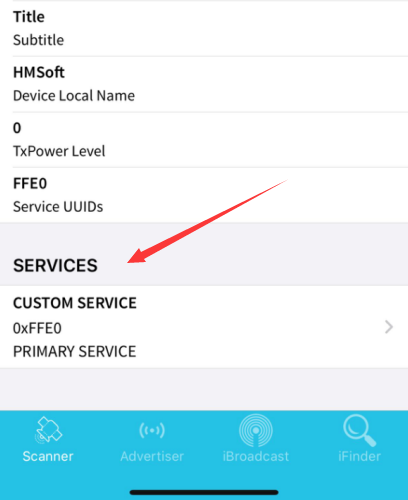  
（7）Потім з'явиться наступна сторінка.  
  
（8）Натисніть слова (Read, Notify, WriteWithoutResponse) синього кольору, щоб перейти на наступну сторінку.  
  
（9）Натисніть "Write Value", і з'явиться сторінка HEX або Tex, як показано на малюнку нижче.  
  
（10）Відкрийте монітор послідовного порту Arduino і введіть 0 або інший символ.  
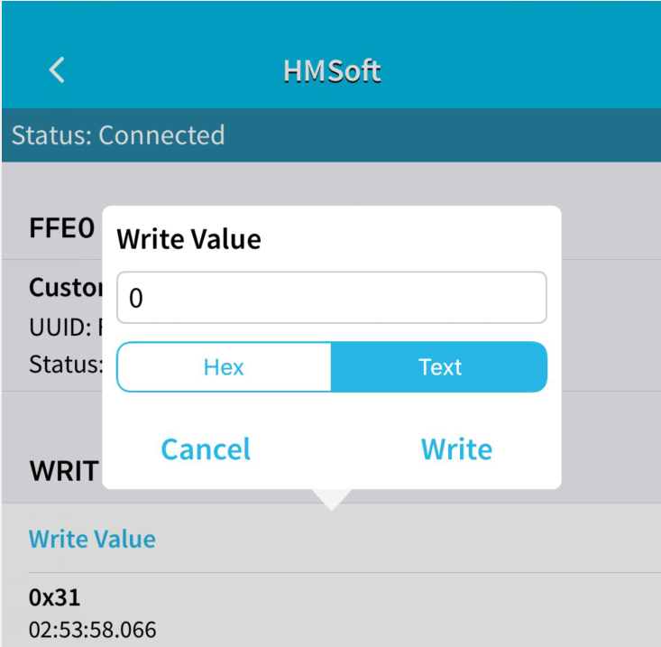  
（11）Натисніть "Write" і відкрийте монітор послідовного порту, щоб підтвердити, чи отримано сигнал 0 або інший символ.  


**7. Пояснення коду**  
**Serial.available()** представляє кількість символів, що залишилися в буфері послідовного порту. Ця функція зазвичай використовується для визначення наявності даних у цій області.
Коли Serial.available() > 0, це означає, що послідовний порт отримав дані і їх можна прочитати. **Serial.read()** означає вилучення та читання байта даних з буфера послідовного порту. Наприклад, якщо пристрій надсилає дані до Arduino через послідовний порт, ми можемо використовувати Serial.read() для читання надісланих даних. **8. Розширений проект** У наведеному вище проекті ми пояснили, що Bluetooth отримує сигнал, надісланий мобільним телефоном, і відображає його на послідовному порту плати розробки. Тепер давайте подумаємо над питанням: чи можемо ми використовувати отриманий сигнал для чогось іншого? Відповідь позитивна. Тут ми плануємо використовувати команду, надіслану мобільним телефоном, для увімкнення або вимкнення світлодіода. Зі схеми підключення ми можемо побачити, що світлодіод підключений до піна D3.  `c++ /* keyestudio Mini Tank Robot V3 урок 10.2 Bluetooth http://www.keyestudio.com */ int LED = 3; int ble_val; //Цілочисельна змінна (використовується для зберігання значення, отриманого через Bluetooth) void setup() { Serial.begin(9600); pinMode(LED, OUTPUT); } void loop() { if (Serial.available() > 0) //Визначити, чи є дані в буфері послідовного порту { ble_val = Serial.read(); //Прочитати дані з буфера послідовного порту Serial.println("DATA RECEIVED:"); Serial.println(ble_val); if (ble_val == '1') { digitalWrite(LED, HIGH); Serial.println("led on"); } if (ble_val == '0') { digitalWrite(LED, LOW); Serial.println("led off"); } } }`   Натисніть Write у мобільному додатку та надішліть 1 або 0 для керування світлодіодом. Коли ви надсилаєте “1”, світлодіод увімкнеться, а коли надсилаєте “0”, світлодіод вимкнеться. (**Після завершення проекту з Bluetooth, відключіть його від плати розробки, щоб не вплинути на процес запису подальшого коду**) ## **Проект 11: Керування двигуном та регулювання швидкості** **(1) Опис:** Існує багато способів керування двигунами. Наш розумний автомобіль використовує найпоширеніше рішення під назвою L298P. L298P, вироблений STMicroelectronics, є чудовою мікросхемою для керування, спеціально розробленою для керування високопотужними двигунами. Він може безпосередньо керувати двигунами постійного струму, двофазними та чотирифазними двигунами з струмом керування до 2А. А вихідний термінал двигуна використовує 8 високошвидкісних діодів Шотткі для захисту. Ми розробили плату розширення на основі схеми L298P, яка може бути безпосередньо підключена до плати UNO R3, що зменшує технічні труднощі для користувачів у використанні та керуванні двигуном. Складіть плату розширення на плату, підключіть живлення BAT, переведіть DIP перемикач на кінець ON і живіть плату розширення та плату UNO R3 одночасно через зовнішнє джерело живлення. Для зручності підключення плата розширення оснащена інтерфейсом захисту від зворотного підключення (PH2.0 -2P -3P -4P -5P), тому її можна безпосередньо підключати до двигунів, джерела живлення та датчиків/модулів. Інтерфейс Bluetooth плати розширення повністю сумісний з модулем Keyestudio HM-10 Bluetooth. Тому нам потрібно лише вставити модуль HM-10 Bluetooth у відповідний інтерфейс при підключенні. Водночас, плата розширення також використовує 2.54 pin headers для розширення деяких доступних цифрових портів та аналогових портів, щоб ви могли продовжувати додавати інші датчики та проводити розширені експерименти. Плата розширення може бути підключена до 4 двигунів постійного струму. У режимі підключення за замовчуванням, двигуни інтерфейсів A і A1, B і B1 підключені паралельно, і їхній режим руху однаковий. 8 перемичок можуть використовуватися для керування напрямком обертання 4 інтерфейсів двигунів. Наприклад, коли дві перемички перед інтерфейсом двигуна A змінюються з горизонтального з'єднання на вертикальне, напрямок обертання двигуна A тепер протилежний до початкового напрямку обертання. **(2) Схема**  **(3) Параметри**: - Вхідна напруга логічної частини: DC 5V - Вхідна напруга частини керування: DC 7-12V - Робочий струм логічної частини: ≤36mA - Робочий струм частини керування: ≤ 2A - Максимальна розсіювана потужність: 25W (T=75℃) - Рівень вхідного сигналу керування: Високий рівень: 2.3V ≤ Vin ≤ 5V Низький рівень: 0V ≤ Vin ≤ 1.5V - Робоча температура: -25℃～＋130℃ **(4) Керування рухом робота** З наведеної вище схеми відомо, що для двигуна A D4 є його піном напрямку, а D5 - піном швидкості, тоді як для двигуна B D2 є його піном напрямку, а D9 - піном швидкості. Відповідно до таблиці нижче, ми можемо знати, як керувати рухом робота, керуючи обертанням двох двигунів через цифрові порти та порти PWM. Серед них діапазон значень PWM становить 0-255. Чим більше значення, тим швидше обертається двигун. | Рухи | D4 | D5（PWM） | Двигун (зліва) | D2 | D9（PWM） | Двигун (справа) | | ------------ |
---- | --------- | -------------------- | ---- | --------- | --------------------- | | Рух Вперед | LOW | 200 | Обертання за годинниковою стрілкою | LOW | 200 | Обертання за годинниковою стрілкою | | Рух Назад | HIGH | 200 | Обертання проти годинникової стрілки | HIGH | 200 | Обертання проти годинникової стрілки | | Обертання Вліво | HIGH | 200 | Обертання проти годинникової стрілки | LOW | 200 | Обертання за годинниковою стрілкою | | Обертання Вправо | LOW | 200 | Обертання за годинниковою стрілкою | HIGH | 200 | Обертання проти годинникової стрілки | | Зупинка | / | 0 | Зупинка | / | 0 | Зупинка | **(5)Необхідні компоненти:** | Keyestudio V4.0 Development Board *1 | Keyestudio L298P Motor Driver Shield | Шасі танкового робота | USB Cable*1 | | ------------------------------------ | ------------------------------------ | -------------------- | -------------------- | |  |  |  |  | **(6)Схема підключення:**  Примітка: На передній частині 4-контактного роз'єму є шовкографія 1234. Один з двох моторів має бути підключений до контакту A (позначений як правий), а інший до контакту B (позначений як лівий). **(7)Тестовий код** `c++ /* keyestudio Mini Tank Robot V3 lesson 11.1 motor driver http://www.keyestudio.com */ #define ML_Ctrl 4 //Визначення контрольного контакту напрямку лівого мотора #define ML_PWM 5 //Визначення PWM контрольного контакту лівого мотора #define MR_Ctrl 2 //Визначення контрольного контакту напрямку правого мотора #define MR_PWM 9 //Визначення PWM контрольного контакту правого мотора void setup() { pinMode(ML_Ctrl, OUTPUT);//Визначення контрольного контакту напрямку лівого мотора як вихідний pinMode(ML_PWM, OUTPUT);//Визначення PWM контрольного контакту лівого мотора як вихідний pinMode(MR_Ctrl, OUTPUT);//Визначення контрольного контакту напрямку правого мотора як вихідний pinMode(MR_PWM, OUTPUT);//Визначення PWM контрольного контакту правого мотора як вихідний } void loop() { digitalWrite(ML_Ctrl, LOW); //Контрольний контакт напрямку лівого мотора на низькому рівні analogWrite(ML_PWM, 200); //Швидкість PWM контролю лівого мотора 200 digitalWrite(MR_Ctrl, LOW); //Контрольний контакт напрямку правого мотора на низькому рівні analogWrite(MR_PWM, 200); //Швидкість PWM контролю правого мотора 200 //вперед delay(2000);//Затримка на 2с digitalWrite(ML_Ctrl, HIGH); //Контрольний контакт напрямку лівого мотора на високому рівні analogWrite(ML_PWM, 200); //Швидкість PWM контролю лівого мотора 200 digitalWrite(MR_Ctrl, HIGH); //Контрольний контакт напрямку правого мотора на високому рівні analogWrite(MR_PWM, 200); //Швидкість PWM контролю правого мотора 200 //назад delay(2000);//Затримка на 2с digitalWrite(ML_Ctrl, HIGH); //Контрольний контакт напрямку лівого мотора на високому рівні analogWrite(ML_PWM, 200); //Швидкість PWM контролю лівого мотора 200 digitalWrite(MR_Ctrl, LOW); //Контрольний контакт напрямку правого мотора на низькому рівні analogWrite(MR_PWM, 200); //Швидкість PWM контролю правого мотора 200 //вліво delay(2000);//Затримка на 2с digitalWrite(ML_Ctrl, LOW); //Контрольний контакт напрямку лівого мотора на низькому рівні analogWrite(ML_PWM, 200); //Швидкість PWM контролю лівого мотора 200 digitalWrite(MR_Ctrl, HIGH); //Контрольний контакт напрямку правого мотора на високому рівні analogWrite(MR_PWM, 200); //Швидкість PWM контролю правого мотора 200 //вправо delay(2000);//Затримка на 2с analogWrite(ML_PWM, 0); //Швидкість PWM контролю лівого мотора 0 analogWrite(MR_PWM, 0); //Швидкість PWM контролю правого мотора 0 //зупинка delay(2000);//Затримка на 2с }` **(8)Результати тесту:** Після підключення згідно зі схемою, завантаження тестового коду та живлення, розумний автомобіль рухається вперед протягом 2с, назад протягом 2с, повертає ліворуч протягом 2с, повертає праворуч протягом 2с і зупиняється на 2с, повторюючи цю послідовність. **(9)Пояснення коду** **digitalWrite(ML_Ctrl,LOW);** Зміна між високим і низьким рівнями може змусити мотори обертатися за годинниковою стрілкою або проти годинникової стрілки. Загальні цифрові контакти можуть використовуватися для контролю цих рухів. **analogWrite(ML_PWM,200);** Регулювання швидкості мотора здійснюється за допомогою PWM, і контакт, який контролює швидкість мотора, повинен бути PWM контактом Arduino. **(10)Розширений проект:** ```c++ /_keyestudio Mini Tank Robot V3 lesson 11.2 motor driver pwm <http://www.keyestudio.com>_/ #define ML_Ctrl 4 //Визначення контрольного контакту напрямку лівого мотора #define ML_PWM 5 //Визначення PWM контрольного контакту лівого мотора #define MR_Ctrl 2 //Визначення контрольного контакту напрямку правого мотора #define MR_PWM 9 //Визначення PWM контрольного контакту правого мотора void setup() { pinMode(ML_Ctrl, OUTPUT);//Визначення контрольного контакту напрямку лівого мотора як вихідний pinMode(ML_PWM, OUTPUT);//Визначення PWM контрольного контакту лівого мотора як вихідний pinMode(MR_Ctrl, OUTPUT);//Визначення контрольного контакту напрямку правого мотора як вихідний

````cpp
pinMode(MR_PWM, OUTPUT);//Визначаємо PWM контрольний пін правого двигуна як вихід } void loop() { digitalWrite(ML_Ctrl, LOW); //Контрольний пін напрямку лівого двигуна на низькому рівні analogWrite(ML_PWM, 100); //Швидкість PWM контролю лівого двигуна становить 100 digitalWrite(MR_Ctrl, LOW); //Контрольний пін напрямку правого двигуна на низькому рівні analogWrite(MR_PWM, 100); //Швидкість PWM контролю правого двигуна становить 100 //вперед delay(2000);//Затримка на 2с digitalWrite(ML_Ctrl, HIGH); //Контрольний пін напрямку лівого двигуна на високому рівні analogWrite(ML_PWM, 100); //Швидкість PWM контролю лівого двигуна становить 100 digitalWrite(MR_Ctrl, HIGH); //Контрольний пін напрямку правого двигуна на високому рівні analogWrite(MR_PWM, 100); //Швидкість PWM контролю правого двигуна становить 100 //назад delay(2000);//Затримка на 2с digitalWrite(ML_Ctrl, HIGH); //Контрольний пін напрямку лівого двигуна на високому рівні analogWrite(ML_PWM, 100); //Швидкість PWM контролю лівого двигуна становить 100 digitalWrite(MR_Ctrl, LOW); //Контрольний пін напрямку правого двигуна на низькому рівні analogWrite(MR_PWM, 100); //Швидкість PWM контролю правого двигуна становить 100 //ліворуч delay(2000);//Затримка на 2с digitalWrite(ML_Ctrl, LOW); //Контрольний пін напрямку лівого двигуна на низькому рівні analogWrite(ML_PWM, 100); //Швидкість PWM контролю лівого двигуна становить 100 digitalWrite(MR_Ctrl, HIGH); //Контрольний пін напрямку правого двигуна на високому рівні analogWrite(MR_PWM, 100); //Швидкість PWM контролю правого двигуна становить 100 //праворуч delay(2000);//Затримка на 2с analogWrite(ML_PWM, 0); //Швидкість PWM контролю лівого двигуна становить 0 analogWrite(MR_PWM, 0); //Швидкість PWM контролю правого двигуна становить 0 //стоп delay(2000);//Затримка на 2с } ```

Примітка: якщо заряд батареї занадто низький, двигуни можуть рухатися з низькою швидкістю і не зможуть повертати.

## **Проект 12: 8*16 Світлодіодна матриця для вираження обличчя**

**(1) Опис:**
Чи не буде весело, якщо до робота додати плату вираження обличчя? І Keyestudio 8\*16 LED dot matrix може це зробити. За допомогою неї ви зможете самостійно створювати вирази обличчя, зображення, візерунки та інші дисплеї. Плата 8\*16 LED містить 128 світлодіодів. Дані мікропроцесора (Arduino) передаються до AiP1640 через двопровідний інтерфейс. Таким чином, вона може керувати ввімкненням і вимкненням 128 світлодіодів на модулі, щоб створити необхідний візерунок на матриці. Для зручності підключення надається кабель HX-2.54 4Pin.

**(2) Параметри:**
- Робоча напруга: DC 3.3-5V
- Втрати потужності: 400mW
- Частота коливань: 450KHz
- Струм приводу: 200mA
- Робоча температура: -40\~80℃
- Режим зв'язку: двопровідний інтерфейс

**(3) Необхідні компоненти:**

| Keyestudio V4.0 Development Board *1 | Keyestudio L298P Motor Driver Shield*1 | keyestudio 8x16 LED Dot Matrix*1 | 4P HX-2.54 Dupont Wire (Black-Red-White-Brown) |
| ------------------------------------ | -------------------------------------- | -------------------------------------- | ---------------------------------------------- |
|  |  |  |  |
| USB cable*1 | | | |
|  | | | |

**(4) Про 8\*16 світлодіодну матрицю**

**Схема 8\*16 світлодіодної матриці**


**Принцип роботи 8\*16 світлодіодної матриці**
Як керувати кожним світлодіодом 8\*16 матриці? Відомо, що кожен байт має 8 бітів, і кожен біт може бути 0 або 1. Коли це 0, світлодіод вимкнений, а коли це 1, світлодіод увімкнений. Один байт може керувати однією колонкою світлодіодів, і природно, 16 байтів можуть керувати 16 колонками світлодіодів, що становить 8\*16 матрицю.

**Опис пінів і протокол зв'язку**
Дані мікропроцесора (Arduino) передаються до AiP1640 через двопровідний інтерфейс. Схема протоколу зв'язку наведена нижче (SCLK) це SCL, (DIN) це SDA


① Початкова умова для введення даних: SCL на високому рівні, а SDA змінюється з високого на низький.
② Для налаштування команди даних існують методи, показані на малюнку нижче. У нашій прикладній програмі вибираємо спосіб **додавання 1 до адреси автоматично**, бінарне значення 0100 0000, а відповідне шістнадцяткове значення 0x40.
|  |
| ------------------------------------------------------------ |
|
③ Для налаштування команди адреси можна вибрати адресу, як показано нижче. У нашій прикладній програмі вибрано першу 00H, а бінарне число 1100 0000 відповідає шістнадцятковому 0xc0.
|
| ------------------------------------------------------------ |
````

 | ④ Вимога для введення даних полягає в тому, що коли SCL знаходиться на високому рівні під час введення даних, сигнал на SDA повинен залишатися незмінним. Тільки коли сигнал годинника на SCL знаходиться на низькому рівні, сигнал на SDA може бути змінений. Введення даних відбувається спочатку з молодшого біта, потім зі старшого біта. ⑤ Умова для завершення передачі даних полягає в тому, що коли SCL знаходиться на низькому рівні, SDA на низькому рівні, а SCL на високому рівні, рівень SDA стає високим. ⑥ Управління дисплеєм, встановлення різної ширини імпульсу, ширина імпульсу може бути обрана, як показано на малюнку нижче. У прикладі ширина імпульсу становить 4/16, і шістнадцяткове значення, що відповідає 1000 1010, дорівнює 0x8A.  4\. Інструкції щодо використання інструменту модуляції Інструмент матричного дисплея використовує онлайн-версію, і посилання: http:/dotmatrixtool.com/\# ① Введіть посилання, і з'явиться сторінка, як показано нижче  ② Матричний дисплей має розмір 8\*16, тому налаштуйте висоту на 8 і ширину на 16, як показано на малюнку нижче  ③ Генерація шістнадцяткових даних з шаблону Як показано на малюнку нижче, натисніть ліву кнопку миші для вибору, праву кнопку для скасування; намалюйте потрібний шаблон, натисніть Generate, і будуть згенеровані необхідні шістнадцяткові дані.  **(5) Схема підключення:**  GND, VCC, SDA та SCL 8x16 LED світлодіодної панелі відповідно підключаються до розширювальної плати датчиків keyestudio -(GND), + (VCC), A4, A5 для двопровідної серійної комунікації. (Примітка: хоча підключення здійснюється до IIC піна Arduino, цей модуль не призначений для IIC комунікації. І порт IO тут використовується для імітації I2C комунікації і може бути підключений до будь-яких двох пінів) **(6) Тестовий код** `c++ /* keyestudio Mini Tank Robot V3 урок 12.1 Матричне обличчя http://www.keyestudio.com */ //отримати дані зображення усмішки з інструменту модуляції unsigned char smile[] = {0x00, 0x00, 0x1c, 0x02, 0x02, 0x02, 0x5c, 0x40, 0x40, 0x5c, 0x02, 0x02, 0x02, 0x1c, 0x00, 0x00}; #define SCL_Pin A5 //встановити пін годинника на A5 #define SDA_Pin A4 //встановити пін даних на A4 void setup() { //встановити пін на ВИХІД pinMode(SCL_Pin, OUTPUT); pinMode(SDA_Pin, OUTPUT); //очистити екран //matrix_display(clear); } void loop() { matrix_display(smile); //відобразити зображення усмішки } //ця функція використовується для відображення матричного дисплея void matrix_display(unsigned char matrix_value[]) { IIC_start(); //використовувати функцію для початку передачі даних IIC_send(0xc0); //вибрати адресу for (int i = 0; i < 16; i++) //дані зображення мають 16 символів { IIC_send(matrix_value[i]); //дані для передачі зображень } IIC_end(); //завершити передачу даних зображень IIC_start(); IIC_send(0x8A); //показати управління та вибрати ширину імпульсу 4/16 IIC_end(); } //умова початку передачі даних void IIC_start() { digitalWrite(SDA_Pin, HIGH); digitalWrite(SCL_Pin, HIGH); delayMicroseconds(3); digitalWrite(SDA_Pin, LOW); delayMicroseconds(3); digitalWrite(SCL_Pin, LOW); } //ознака завершення передачі даних void IIC_end() { digitalWrite(SCL_Pin, LOW); digitalWrite(SDA_Pin, LOW); delayMicroseconds(3); digitalWrite(SCL_Pin, HIGH); delayMicroseconds(3); digitalWrite(SDA_Pin, HIGH); delayMicroseconds(3); } //передача даних void IIC_send(unsigned char send_data) { for (byte mask = 0x01; mask != 0; mask <<= 1) //кожен символ має 8 цифр, які перевіряються по одному { if (send_data & mask) { // встановити високий або низький рівень відповідно до кожного біта (0 або 1) digitalWrite(SDA_Pin, HIGH); } else { digitalWrite(SDA_Pin, LOW); } delayMicroseconds(3); digitalWrite(SCL_Pin, HIGH); //підняти пін годинника SCL_Pin для завершення передачі даних delayMicroseconds(3); digitalWrite(SCL_Pin, LOW); //опустити пін годинника SCL_Pin для зміни сигналів SDA } }` **(7) Результати тесту:** Після успішного завантаження тестового коду, підключення згідно зі схемою підключення, перемикання DIP-перемикача на правий кінець і увімкнення живлення, на матричному дисплеї з'явиться зображення у вигляді усмішки. >  **(8) Розширений проект:** Ми використовуємо інструмент модуляції, який ми щойно вивчили, http:/dotmatrixtool.com/\#, щоб зробити так, щоб матричний дисплей показував шаблон старту, руху вперед і зупинки, а потім очищав шаблон. Інтервал часу становить 2000 мс. 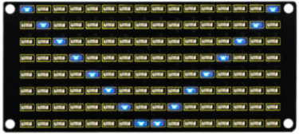  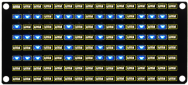 **Код, отриманий з інструменту модуляції:** **Код для** **шаблону старту:**
0x01,0x02,0x04,0x08,0x10,0x20,0x40,0x80,0x80,0x40,0x20,0x10,0x08,0x04,0x02,0x01 **Код для шаблону, що рухається вперед:** 0x00,0x00,0x00,0x00,0x00,0x24,0x12,0x09,0x12,0x24,0x00,0x00,0x00,0x00,0x00,0x00 **Код для шаблону, що рухається назад:** 0x00,0x00,0x00,0x00,0x00,0x24,0x48,0x90,0x48,0x24,0x00,0x00,0x00,0x00,0x00,0x00 **Код для шаблону, що повертає ліворуч:** 0x00,0x00,0x00,0x00,0x00,0x00,0x44,0x28,0x10,0x44,0x28,0x10,0x44,0x28,0x10,0x00 **Код для шаблону, що повертає праворуч:** 0x00,0x10,0x28,0x44,0x10,0x28,0x44,0x10,0x28,0x44,0x00,0x00,0x00,0x00,0x00,0x00 **Код для шаблону зупинки:** 0x2E,0x2A,0x3A,0x00,0x02,0x3E,0x02,0x00,0x3E,0x22,0x3E,0x00,0x3E,0x0A,0x0E,0x00 **Код для очищення екрану:** 0x00,0x00,0x00,0x00,0x00,0x00,0x00,0x00,0x00,0x00,0x00,0x00,0x00,0x00,0x00,0x00 **Повний код:** `c++ /* keyestudio Mini Tank Robot V3 урок 12.2 Матриця обличчя http://www.keyestudio.com */ //Масив, використовується для збереження даних зображень, може бути розрахований самостійно або отриманий за допомогою інструменту модулювання unsigned char start01[] = {0x01, 0x02, 0x04, 0x08, 0x10, 0x20, 0x40, 0x80, 0x80, 0x40, 0x20, 0x10, 0x08, 0x04, 0x02, 0x01}; unsigned char front[] = {0x00, 0x00, 0x00, 0x00, 0x00, 0x24, 0x12, 0x09, 0x12, 0x24, 0x00, 0x00, 0x00, 0x00, 0x00, 0x00}; unsigned char back[] = {0x00, 0x00, 0x00, 0x00, 0x00, 0x24, 0x48, 0x90, 0x48, 0x24, 0x00, 0x00, 0x00, 0x00, 0x00, 0x00}; unsigned char left[] = {0x00, 0x00, 0x00, 0x00, 0x00, 0x00, 0x44, 0x28, 0x10, 0x44, 0x28, 0x10, 0x44, 0x28, 0x10, 0x00}; unsigned char right[] = {0x00, 0x10, 0x28, 0x44, 0x10, 0x28, 0x44, 0x10, 0x28, 0x44, 0x00, 0x00, 0x00, 0x00, 0x00, 0x00}; unsigned char STOP01[] = {0x2E, 0x2A, 0x3A, 0x00, 0x02, 0x3E, 0x02, 0x00, 0x3E, 0x22, 0x3E, 0x00, 0x3E, 0x0A, 0x0E, 0x00}; unsigned char clear[] = {0x00, 0x00, 0x00, 0x00, 0x00, 0x00, 0x00, 0x00, 0x00, 0x00, 0x00, 0x00, 0x00, 0x00, 0x00, 0x00}; #define SCL_Pin A5 //встановити пін годинника на A5 #define SDA_Pin A4 //встановити пін даних на A4 void setup() { //встановити пін на ВИХІД pinMode(SCL_Pin, OUTPUT); pinMode(SDA_Pin, OUTPUT); //очистити екран matrix_display(clear); } void loop() { matrix_display(start01); //показати зображення "Start" delay(2000); matrix_display(front); //показати зображення "front" delay(2000); matrix_display(STOP01); //показати зображення "STOP01" delay(2000); matrix_display(clear); //показати зображення "clear" delay(2000); } //ця функція використовується для відображення точкової матриці void matrix_display(unsigned char matrix_value[]) { IIC_start(); //використовувати функцію для початку передачі даних IIC_send(0xc0); //вибрати адресу for (int i = 0; i < 16; i++) //дані зображення мають 16 символів { IIC_send(matrix_value[i]); //дані для передачі зображень } IIC_end(); //закінчити передачу даних зображень IIC_start(); IIC_send(0x8A); //показати контроль і вибрати ширину імпульсу 4/16 IIC_end(); } //умова початку передачі даних void IIC_start() { digitalWrite(SDA_Pin, HIGH); digitalWrite(SCL_Pin, HIGH); delayMicroseconds(3); digitalWrite(SDA_Pin, LOW); delayMicroseconds(3); digitalWrite(SCL_Pin, LOW); } //ознака закінчення передачі даних void IIC_end() { digitalWrite(SCL_Pin, LOW); digitalWrite(SDA_Pin, LOW); delayMicroseconds(3); digitalWrite(SCL_Pin, HIGH); delayMicroseconds(3); digitalWrite(SDA_Pin, HIGH); delayMicroseconds(3); } //передача даних void IIC_send(unsigned char send_data) { for (byte mask = 0x01; mask != 0; mask <<= 1) //кожен символ має 8 цифр, які перевіряються по черзі { if (send_data & mask) { //встановити високий або низький рівень відповідно до кожного біта (0 або 1) digitalWrite(SDA_Pin, HIGH); } else { digitalWrite(SDA_Pin, LOW); } delayMicroseconds(3); digitalWrite(SCL_Pin, HIGH); //підняти пін годинника SCL_Pin для завершення передачі даних delayMicroseconds(3); digitalWrite(SCL_Pin, LOW); //опустити пін годинника SCL_Pin для зміни сигналів SDA } }` Після завантаження тестового коду, плата виразу обличчя показує ці шаблони по черзі та повторює цю послідовність.  ## **Проект 13: Танковий робот, що слідує за світлом**  **(1)Опис**: У попередніх проектах ми детально розглянули використання різних датчиків, модулів та розширювальних плат на смарт-карі. Тепер переходимо до проектів смарт-карів. Смарт-кари, що слідують за світлом, як випливає з назви, це смарт-кари, які можуть слідувати за світлом. Ми можемо об'єднати знання з проектів з фоторезисторами та приводами моторів, щоб створити смарт-кар, що шукає світло. У проекті ми використовуємо два модулі фоторезисторів для виявлення інтенсивності світла на
ліворуч і праворуч від розумного автомобіля, зчитувати відповідні аналогові значення, а потім керувати обертанням двох моторів на основі цих двох даних, щоб керувати рухами розумного автомобіля. Конкретна логіка роботи автомобіля, що слідує за світлом, показана нижче.  **(2)Блок-схема**  **(3)Схема підключення:**  Примітка: Контакти "-", "+" і S фоторезисторного модуля зліва підключені до G (GND), V (VCC), A0 відповідно; контакти "-", "+" і S фоторезисторного модуля справа підключені до G (GND), V (VCC) і A1 відповідно. На передній частині 4-контактного кабелю є шовкографія 1234. Червоний провід заднього правого мотора підключений до 1, чорний провід підключений до 2, чорний провід переднього лівого мотора підключений до 4, а червоний провід підключений до 3. **(4)Тестовий код** `c++ /* keyestudio Mini Tank Robot V3 урок 13 танк, що слідує за світлом http://www.keyestudio.com */ #define light_L_Pin A0 //Визначити контакт датчика світла зліва #define light_R_Pin A1 //Визначити контакт датчика світла справа #define ML_Ctrl 4 //Визначити контакт керування напрямком лівого мотора #define ML_PWM 5 //Визначити контакт керування PWM лівого мотора #define MR_Ctrl 2 //Визначити контакт керування напрямком правого мотора #define MR_PWM 9 //Визначити контакт керування PWM правого мотора int left_light; int right_light; void setup() { Serial.begin(9600); pinMode(light_L_Pin, INPUT); pinMode(light_R_Pin, INPUT); pinMode(ML_Ctrl, OUTPUT); pinMode(ML_PWM, OUTPUT); pinMode(MR_Ctrl, OUTPUT); pinMode(MR_PWM, OUTPUT); } void loop() { left_light = analogRead(light_L_Pin); right_light = analogRead(light_R_Pin); Serial.print("left_light_value = "); Serial.println(left_light); Serial.print("right_light_value = "); Serial.println(right_light); if (left_light > 650 && right_light > 650) //Діапазон значень, виявлених датчиком світла, рух вперед { Car_front(); } else if (left_light > 650 && right_light <= 650) //Діапазон значень, виявлених датчиком світла, поворот ліворуч { Car_left(); } else if (left_light <= 650 && right_light > 650) //Діапазон значень, виявлених датчиком світла, поворот праворуч { Car_right(); } else //В інших умовах зупинка { Car_Stop(); } } void Car_front() { digitalWrite(MR_Ctrl, LOW); analogWrite(MR_PWM, 200); digitalWrite(ML_Ctrl, LOW); analogWrite(ML_PWM, 200); } void Car_left() { digitalWrite(MR_Ctrl, LOW); analogWrite(MR_PWM, 200); digitalWrite(ML_Ctrl, HIGH); analogWrite(ML_PWM, 200); } void Car_right() { digitalWrite(MR_Ctrl, HIGH); analogWrite(MR_PWM, 200); digitalWrite(ML_Ctrl, LOW); analogWrite(ML_PWM, 200); } void Car_Stop() { digitalWrite(MR_Ctrl, LOW); analogWrite(MR_PWM, 0); digitalWrite(ML_Ctrl, LOW); analogWrite(ML_PWM, 0); }` **(5)Результати тесту:** Після успішного завантаження тестового коду, підключення згідно зі схемою підключення, переведення DIP-перемикача в праве положення та подачі живлення, розумний автомобіль слідує за світлом. ## **Проект 14: Танк, що слідує за ультразвуком**  **(1)Опис:** У попередньому уроці ми дізналися про автомобіль, що слідує за світлом. У цьому уроці ми можемо поєднати знання для створення автомобіля, що слідує за ультразвуком. У проекті ми використовуємо ультразвукові датчики для виявлення відстані між автомобілем і перешкодою попереду, а потім керуємо обертанням двох моторів на основі цих даних, щоб керувати рухами розумного автомобіля. Конкретна логіка роботи автомобіля, що слідує за ультразвуком, показана в таблиці нижче:  **(2)Блок-схема**  **(3)Схема підключення:**  **(4)Тестовий код** ```c++ /_keyestudio Mini Tank Robot V3 урок 14 танк, що слідує за ультразвуком <http://www.keyestudio.com>_/ #define servoPin 10 //Контакт сервоприводу #define ML_Ctrl 4 //Визначити контакт керування напрямком лівого мотора #define ML_PWM 5 //Визначити контакт керування PWM лівого мотора #define MR_Ctrl 2 //Визначити контакт керування напрямком правого мотора #define MR_PWM 9 //Визначити контакт керування PWM правого мотора #define Trig 12 #define Echo 13 float distance; void setup() { pinMode(servoPin, OUTPUT); pinMode(Trig, OUTPUT); pinMode(Echo, INPUT); pinMode(ML_Ctrl, OUTPUT); pinMode(ML_PWM, OUTPUT); pinMode(MR_Ctrl, OUTPUT); pinMode(MR_PWM, OUTPUT); procedure(90); //Встановити кут сервоприводу на 90° delay(500); //Затримка 500 мс } void loop() { distance = checkdistance(); //Призначити відстань

````c++
вимірюється ультразвуковим звуком до відстані if (distance >= 20 && distance <= 60) //Діапазон відстані для руху вперед { Car_front(); } else if (distance > 10 && distance < 20) //Діапазон відстані для зупинки { Car_Stop(); } else if (distance <= 10) //Діапазон відстані для руху назад { Car_back(); } else //В інших умовах зупиняється { Car_Stop(); } } void Car_front() { digitalWrite(MR_Ctrl, LOW); analogWrite(MR_PWM, 200); digitalWrite(ML_Ctrl, LOW); analogWrite(ML_PWM, 200); } void Car_back() { digitalWrite(MR_Ctrl,HIGH); analogWrite(MR_PWM,200); digitalWrite(ML_Ctrl,HIGH); analogWrite(ML_PWM,200); } void Car_left() { digitalWrite(MR_Ctrl, LOW); analogWrite(MR_PWM, 200); digitalWrite(ML_Ctrl, HIGH); analogWrite(ML_PWM, 200); } void Car_right() { digitalWrite(MR_Ctrl, HIGH); analogWrite(MR_PWM, 200); digitalWrite(ML_Ctrl, LOW); analogWrite(ML_PWM, 200); } void Car_Stop() { digitalWrite(MR_Ctrl, LOW); analogWrite(MR_PWM, 0); digitalWrite(ML_Ctrl, LOW); analogWrite(ML_PWM, 0); } //Функція керує сервоприводами void procedure(byte myangle) { int pulsewidth; for (int i = 0; i < 5; i++) { pulsewidth = myangle * 11 + 500; //Обчислення значення ширини імпульсу digitalWrite(servoPin, HIGH); delayMicroseconds(pulsewidth); //Час у високому рівні представляє ширину імпульсу digitalWrite(servoPin, LOW); delay((20 - pulsewidth / 1000)); //Оскільки цикл становить 20мс, залишковий час знаходиться на низькому рівні } } //Функція керує ультразвуковим звуком float checkdistance() { static float distance; digitalWrite(Trig, LOW); delayMicroseconds(2); digitalWrite(Trig, HIGH); delayMicroseconds(10); digitalWrite(Trig, LOW); distance = pulseIn(Echo, HIGH) / 58.20; //58.20 тут походить від 2*29.1=58.2 delay(10); return distance; } ``` **(5)Результати тестування:** Після успішного завантаження тестового коду, підключення згідно зі схемою з'єднань, перемикання DIP-перемикача на правий кінець, увімкнення живлення та встановлення сервоприводу на 9°, розумний автомобіль рухається разом із перешкодою. ## **Проект 15: Ультразвуковий танк для уникнення перешкод**  **(1)Опис:** У попередньому проекті ми створили розумний автомобіль, що слідує за ультразвуковим звуком. Насправді, використовуючи ті ж компоненти та той самий метод підключення, нам потрібно лише змінити тестовий код, щоб перетворити його на розумний автомобіль для уникнення ультразвукових перешкод. Цей розумний автомобіль може рухатися разом із рухом людських рук. Ми використовуємо ультразвукові датчики для виявлення відстані між розумним автомобілем та перешкодою попереду, а потім керуємо обертанням двох двигунів на основі цих даних, щоб керувати рухами розумного автомобіля.    Конкретна логіка роботи розумного автомобіля для уникнення ультразвукових перешкод показана в таблиці нижче: **(2)Блок-схема**  **(3)Схема з'єднань:**  (Примітка: контакти “-”, “+” і S сервоприводу відповідно підключені до G (GND), V (VCC) і D10 розширювальної плати; для ультразвукового датчика контакт VCC підключений до 5v (V), контакт Trig до цифрового 12 (S), контакт Echo до цифрового 13 (S), а контакт Gnd до Gnd (G); так само, як у попередньому проекті.) **(4)Тестовий код** ```c++ /* keyestudio Mini Tank Robot V3 урок 15 Ультразвуковий танк для уникнення перешкод http://www.keyestudio.com */ #define servoPin 10 //Контакт сервоприводу int a, a1, a2; #define ML_Ctrl 4 //Визначення контакту керування напрямком лівого двигуна #define ML_PWM 5 //Визначення контакту керування PWM лівого двигуна #define MR_Ctrl 2 //Визначення контакту керування напрямком правого двигуна #define MR_PWM 9 //Визначення контакту керування PWM правого двигуна #define Trig 12 #define Echo 13 float distance; void setup() { Serial.begin(9600); pinMode(servoPin, OUTPUT); pinMode(Trig, OUTPUT); pinMode(Echo, INPUT); pinMode(ML_Ctrl, OUTPUT); pinMode(ML_PWM, OUTPUT); pinMode(MR_Ctrl, OUTPUT); pinMode(MR_PWM, OUTPUT); procedure(90); //Встановлення кута сервоприводу на 90° delay(500); //Затримка 500мс } void loop() { a = checkdistance(); //Присвоєння змінній a відстані, виявленої ультразвуковим датчиком спереду if (a < 20) {//Коли відстань до перешкоди спереду менше 20см Car_Stop(); //Робот зупиняється delay(500); //Затримка 500мс procedure(180); //Ультразвуковий панорамний механізм повертається ліворуч delay(500); //Затримка 500мс a1 = checkdistance(); //Присвоєння змінній a1 відстані, виявленої ультразвуковим датчиком зліва delay(100); // procedure(0); //Ультразвуковий панорамний механізм повертається праворуч delay(500); //Затримка 500мс a2 = checkdistance(); //Присвоєння змінній a2 відстані, виявленої ультразвуковим датчиком справа delay(100); //
````

````c++
procedure(90); //Повернення до 90° delay(500); if (a1 > a2) { //Коли відстань зліва більша, ніж справа Car_left(); //Робот повертає ліворуч delay(700); //Повертає ліворуч протягом 700мс } else { Car_right(); //Робот повертає праворуч delay(700); } } else { //Коли відстань спереду >=20см, робот рухається вперед Car_front(); //Рух вперед } } void Car_front() { digitalWrite(MR_Ctrl, LOW); analogWrite(MR_PWM, 200); digitalWrite(ML_Ctrl, LOW); analogWrite(ML_PWM, 200); } void Car_back() { digitalWrite(MR_Ctrl, HIGH); analogWrite(MR_PWM, 200); digitalWrite(ML_Ctrl, HIGH); analogWrite(ML_PWM, 200); } void Car_left() { digitalWrite(MR_Ctrl, LOW); analogWrite(MR_PWM, 200); digitalWrite(ML_Ctrl, HIGH); analogWrite(ML_PWM, 200); } void Car_right() { digitalWrite(MR_Ctrl, HIGH); analogWrite(MR_PWM, 200); digitalWrite(ML_Ctrl, LOW); analogWrite(ML_PWM, 200); } void Car_Stop() { digitalWrite(MR_Ctrl, LOW); analogWrite(MR_PWM, 0); digitalWrite(ML_Ctrl, LOW); analogWrite(ML_PWM, 0); } //Функція керування сервоприводами void procedure(byte myangle) { int pulsewidth; for (int i = 0; i < 5; i++) { pulsewidth = myangle * 11 + 500; //Обчислення ширини імпульсу digitalWrite(servoPin, HIGH); delayMicroseconds(pulsewidth); //Час на високому рівні відповідає ширині імпульсу digitalWrite(servoPin, LOW); delay((20 - pulsewidth / 1000)); //Оскільки цикл становить 20мс, залишковий час на низькому рівні } } //Функція керування ультразвуковим датчиком float checkdistance() { float distance; digitalWrite(Trig, LOW); delayMicroseconds(2); digitalWrite(Trig, HIGH); delayMicroseconds(10); digitalWrite(Trig, LOW); distance = pulseIn(Echo, HIGH) / 58.20; //58.20 тут походить від 2*29.1=58.2 delay(10); return distance; } ``` **(5)Результати тестування:** Після успішного завантаження тестового коду, підключення проводів, перемикання DIP-перемикача в положення ON і подачі живлення, смарт-кар рухається вперед і автоматично уникає перешкод. ## **Проект 16: Рух у замкнутому просторі танка**  **(1)Опис:** Ми детально розглянули ультразвукове слідування та уникнення перешкод раніше. Відповідно до попередніх курсів, ми створюємо смарт-кар, який слідує за своїм треком. У експерименті датчик відстеження виявляє, чи є чорна лінія на дні смарт-кара для керування обертанням двох моторів, тим самим утримуючи смарт-кар у колі з чорної лінії. Специфічна логіка відстеження наступна:  **(2)Блок-схема**  **(3)Схема підключення:**  **(4)Тестовий код** ```c++ /* keyestudio Mini Tank Robot V3 урок 16 малювання кола для танка http://www.keyestudio.com */ //Підключення датчика відстеження лінії #define L_pin 6 //Ліворуч #define M_pin 7 //Посередині #define R_pin 8 //Праворуч #define ML_Ctrl 4 //Визначення піну керування напрямком лівого мотора #define ML_PWM 5 //Визначення піну керування PWM лівого мотора #define MR_Ctrl 2 //Визначення піну керування напрямком правого мотора #define MR_PWM 9 //Визначення піну керування PWM правого мотора int L_val, M_val, R_val; void setup() { Serial.begin(9600); //Встановлення швидкості передачі даних на 9600 pinMode(L_pin, INPUT); //Встановлення всіх пінів датчика відстеження лінії як вхідні pinMode(M_pin, INPUT); pinMode(R_pin, INPUT); pinMode(ML_Ctrl, OUTPUT); pinMode(ML_PWM, OUTPUT); pinMode(MR_Ctrl, OUTPUT); pinMode(MR_PWM, OUTPUT); } void loop () { L_val = digitalRead(L_pin); //Читання значення лівого датчика M_val = digitalRead(M_pin); //Читання значення середнього датчика R_val = digitalRead(R_pin); //Читання значення правого датчика if ( L_val == 0 && M_val == 0 && R_val == 0 ) { //Коли чорні лінії не виявлено, рухається вперед Car_front(); } else { //Інакше, якщо будь-який датчик відстеження лінії виявляє чорну лінію, він повертається назад і потім ліворуч Car_back(); delay(700); Car_left(); delay(800); } } void Car_front() { digitalWrite(MR_Ctrl, LOW); analogWrite(MR_PWM, 200); digitalWrite(ML_Ctrl, LOW); analogWrite(ML_PWM, 200); } void Car_back() { digitalWrite(MR_Ctrl, HIGH); analogWrite(MR_PWM, 200); digitalWrite(ML_Ctrl, HIGH); analogWrite(ML_PWM, 200); } void Car_left() { digitalWrite(MR_Ctrl, LOW); analogWrite(MR_PWM, 200); digitalWrite(ML_Ctrl, HIGH); analogWrite(ML_PWM, 200); } void Car_right() { digitalWrite(MR_Ctrl, HIGH); analogWrite(MR_PWM, 200); digitalWrite(ML_Ctrl, LOW); analogWrite(ML_PWM, 200); } void Car_Stop() { digitalWrite(MR_Ctrl, LOW); analogWrite(MR_PWM, 0); digitalWrite(ML_Ctrl, LOW); analogWrite(ML_PWM, 0); } ``` **(5)Результати тестування:** Після завантаження тестового коду
````

успішно, і після ввімкнення розумний автомобіль рухається в обмеженому просторі, коло намальоване чорною лінією.

## **Проект 17: Танк, що слідує за лінією**

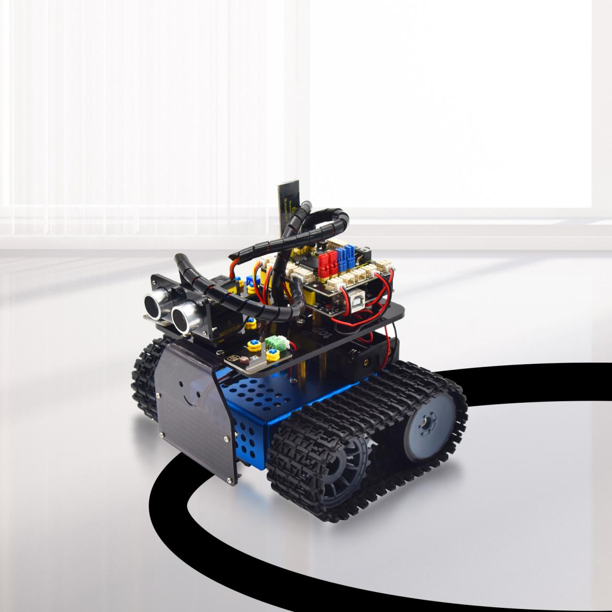

**(1)Опис:**
У попередньому проекті було показано, як обмежити рух розумного автомобіля в певному просторі. У цьому проекті ми можемо використати раніше отримані знання, щоб створити розумний автомобіль, що слідує за лінією. У експерименті ми використовуємо датчик слідування за лінією для виявлення наявності чорної лінії навколо розумного автомобіля, а потім керуємо обертанням двох моторів відповідно до результатів виявлення, щоб розумний автомобіль рухався вздовж чорної лінії. Конкретна логіка роботи розумного автомобіля, що слідує за лінією, показана в таблиці нижче:


**(2)Блок-схема**


**(3)Схема підключення:**

Примітка: вона така ж, як у попередньому проекті.

**(4)Тестовий код**

```c++
/* keyestudio Mini Tank Robot V3 урок 17 Танк, що слідує за лінією
http://www.keyestudio.com */

//Підключення датчика слідування за лінією
#define L_pin 6 //Зліва
#define M_pin 7 //Посередині
#define R_pin 8 //Справа
#define ML_Ctrl 4 //Визначення піну керування напрямком лівого мотора
#define ML_PWM 5 //Визначення PWM піну лівого мотора
#define MR_Ctrl 2 //Визначення піну керування напрямком правого мотора
#define MR_PWM 9 //Визначення PWM піну правого мотора

int L_val, M_val, R_val;

void setup() {
  Serial.begin(9600); //Встановити швидкість передачі даних на 9600
  pinMode(L_pin, INPUT); //Встановити всі піни датчика слідування за лінією в режим введення
  pinMode(M_pin, INPUT);
  pinMode(R_pin, INPUT);
  pinMode(ML_Ctrl, OUTPUT);
  pinMode(ML_PWM, OUTPUT);
  pinMode(MR_Ctrl, OUTPUT);
  pinMode(MR_PWM, OUTPUT);
}

void loop () {
  L_val = digitalRead(L_pin); //Зчитати значення лівого датчика
  M_val = digitalRead(M_pin); //Зчитати значення середнього датчика
  R_val = digitalRead(R_pin); //Зчитати значення правого датчика

  if (M_val == 1) { //Чорна лінія виявлена посередині
    if (L_val == 1 && R_val == 0) { //Чорна лінія виявлена зліва, але не справа, повертає ліворуч
      Car_left();
    } else if (L_val == 0 && R_val == 1) { //Чорна лінія виявлена справа, але не зліва, повертає праворуч
      Car_right();
    } else { //Або рухається вперед
      Car_front();
    }
  } else { //Чорна лінія не виявлена посередині
    if (L_val == 1 && R_val == 0) { //Чорна лінія виявлена зліва, але не справа, повертає ліворуч
      Car_left();
    } else if (L_val == 0 && R_val == 1) { //Чорна лінія виявлена справа, але не зліва, повертає праворуч
      Car_right();
    } else { //Інакше зупиняється
      Car_Stop();
    }
  }
}

//Рух вперед
void Car_front() {
  digitalWrite(MR_Ctrl, LOW);
  analogWrite(MR_PWM, 150);
  digitalWrite(ML_Ctrl, LOW);
  analogWrite(ML_PWM, 150);
}

//Рух назад
void Car_back() {
  digitalWrite(MR_Ctrl, HIGH);
  analogWrite(MR_PWM, 150);
  digitalWrite(ML_Ctrl, HIGH);
  analogWrite(ML_PWM, 150);
}

//Поворот ліворуч
void Car_left() {
  digitalWrite(MR_Ctrl, LOW);
  analogWrite(MR_PWM, 250);
  digitalWrite(ML_Ctrl, HIGH);
  analogWrite(ML_PWM, 100);
}

//Поворот праворуч
void Car_right() {
  digitalWrite(MR_Ctrl, HIGH);
  analogWrite(MR_PWM, 100);
  digitalWrite(ML_Ctrl, LOW);
  analogWrite(ML_PWM, 250);
}

//Зупинка
void Car_Stop() {
  digitalWrite(MR_Ctrl, LOW);
  analogWrite(MR_PWM, 0);
  digitalWrite(ML_Ctrl, LOW);
  analogWrite(ML_PWM, 0);
}
```

**(5)Результати тесту:**
Після успішного завантаження тестового коду та ввімкнення живлення, розумний автомобіль рухається вздовж чорної лінії.

## **Проект 18: Танк для гасіння вогню**


**(1)Опис:**
Функція слідування за лінією розумного танка була пояснена в попередньому проекті. У цьому проекті ми використовуємо датчик полум'я для створення робота для гасіння вогню. Коли автомобіль виявляє полум'я, мотор вентилятора починає обертатися, щоб загасити вогонь. Звичайно, спочатку потрібно замінити ультразвуковий датчик і два фоторезистори на модуль вентилятора і датчики полум'я. Конкретна логіка роботи розумного автомобіля, що слідує за лінією, показана в таблиці нижче:

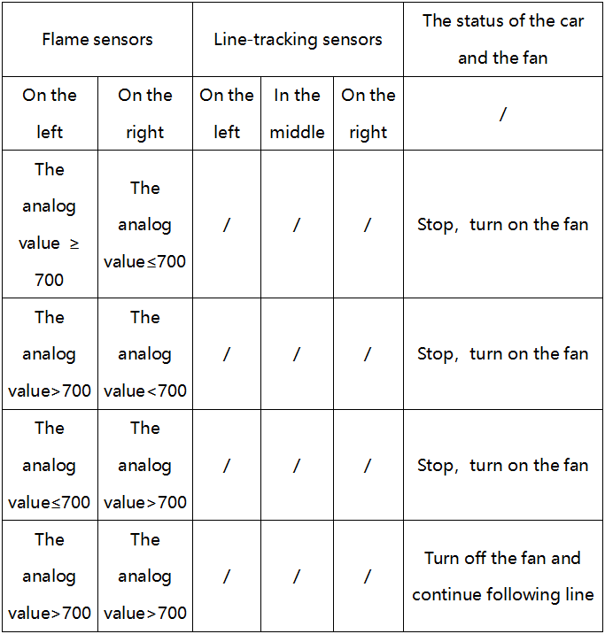

**(2)Блок-схема**


**(3)Схема підключення:**

Примітка: GND, VCC, SDA та SCL матриці світлодіодів 8x16 підключаються відповідно до -(GND), + (VCC), SDA, SCL на платі розширення V5; Піни "-", "+" і S інфрачервоного приймача підключаються відповідно до G (GND), V (VCC), A0 на платі розширення за допомогою проводів. Коли цифровий порт недостатній, можна використовувати аналоговий порт.
використовується як цифровий порт, а аналоговий порт A0 еквівалентний цифровому порту 14, A1 еквівалентний цифровому порту 15 і так далі. **(4)Тестовий код** `c++ /* keyestudio Mini Tank Robot V3 урок 18 Вогнегасний танк http://www.keyestudio.com */ /* keyestudio Mini Tank Robot V3 урок 18 Вогнегасний танк http://www.keyestudio.com */ int flame_L = A0; //Визначаємо інтерфейс полум'я зліва як аналоговий пін A0 int flame_R = A1; //Визначаємо інтерфейс полум'я справа як аналоговий пін A1 //Підключення сенсора лінійного слідкування #define L_pin 6 //Зліва #define M_pin 7 //Посередині #define R_pin 8 //Справа //Пін сервоприводу 130 int INA = 12; int INB = 13; #define ML_Ctrl 4 //Визначаємо пін керування напрямком лівого двигуна #define ML_PWM 5 //Визначаємо пін PWM керування лівого двигуна #define MR_Ctrl 2 //Визначаємо пін керування напрямком правого двигуна #define MR_PWM 9 //Визначаємо пін PWM керування правого двигуна int L_val, M_val, R_val, flame_valL, flame_valR; void setup() { Serial.begin(9600); //Встановлюємо всі піни сенсора лінійного слідкування як вхідні pinMode(L_pin, INPUT); pinMode(M_pin, INPUT); pinMode(R_pin, INPUT); //Визначаємо полум'я як ВХІД pinMode(flame_L, INPUT); pinMode(flame_R, INPUT); //Визначаємо двигун як ВИХІД pinMode(ML_Ctrl, OUTPUT); pinMode(ML_PWM, OUTPUT); pinMode(MR_Ctrl, OUTPUT); pinMode(MR_PWM, OUTPUT); pinMode(INA, OUTPUT);//Встановлюємо цифровий порт INA як ВИХІД pinMode(INB, OUTPUT);//Встановлюємо цифровий порт INB як ВИХІД } void loop () { //Зчитуємо аналогове значення сенсорів полум'я flame_valL = analogRead(flame_L); flame_valR = analogRead(flame_R); // Serial.print(flame_valL); // Serial.print(" "); // Serial.print(flame_valR); // Serial.println(" "); // delay(500); if (flame_valL <= 700 || flame_valR <= 700) { Car_Stop(); fan_begin(); } else { fan_stop(); L_val = digitalRead(L_pin); //Зчитуємо значення лівого сенсора M_val = digitalRead(M_pin); //Зчитуємо значення середнього сенсора R_val = digitalRead(R_pin); //Зчитуємо значення правого сенсора if (M_val == 1) { //середній сенсор виявляє чорну лінію if (L_val == 1 && R_val == 0) { //Якщо чорна лінія виявлена зліва і не виявлена справа, повертає ліворуч Car_left(); } else if (L_val == 0 && R_val == 1) { //Якщо чорна лінія виявлена справа і не виявлена зліва, повертає праворуч Car_right(); } else { //Або рухається вперед Car_front(); } } else { //Чорна лінія не виявлена посередині if (L_val == 1 && R_val == 0) { //Якщо чорна лінія виявлена зліва і не виявлена справа, повертає ліворуч Car_left(); } else if (L_val == 0 && R_val == 1) { //Якщо чорна лінія виявлена справа і не виявлена зліва, повертає праворуч Car_right(); } else { //Інакше зупиняється Car_Stop(); } } } } void fan_stop() { //Інакше зупиняється digitalWrite(INA, LOW); digitalWrite(INB, LOW); } void fan_begin() { //Вентилятор працює digitalWrite(INA, LOW); digitalWrite(INB, HIGH); } void Car_front() { digitalWrite(MR_Ctrl, LOW); analogWrite(MR_PWM, 150); digitalWrite(ML_Ctrl, LOW); analogWrite(ML_PWM, 150); } void Car_back() { digitalWrite(MR_Ctrl, HIGH); analogWrite(MR_PWM, 200); digitalWrite(ML_Ctrl, HIGH); analogWrite(ML_PWM, 200); } void Car_left() { digitalWrite(MR_Ctrl, LOW); analogWrite(MR_PWM, 200); digitalWrite(ML_Ctrl, HIGH); analogWrite(ML_PWM, 100); } void Car_right() { digitalWrite(MR_Ctrl, HIGH); analogWrite(MR_PWM, 100); digitalWrite(ML_Ctrl, LOW); analogWrite(ML_PWM, 200); } void Car_Stop() { digitalWrite(MR_Ctrl, HIGH); analogWrite(MR_PWM, 200); digitalWrite(ML_Ctrl, HIGH); analogWrite(ML_PWM, 200); digitalWrite(MR_Ctrl, LOW); analogWrite(MR_PWM, 0); digitalWrite(ML_Ctrl, LOW); analogWrite(ML_PWM, 0); }` **(5)Результати тесту:** Після успішного завантаження тестового коду і підключення живлення, смарт-автомобіль гасить вогонь, коли виявляє полум'я, і продовжує рухатися вздовж чорної лінії. ## **Проект 19: Танк з ІЧ дистанційним керуванням**  **(1)Опис:** Інфрачервоне дистанційне керування є одним з найпоширеніших способів дистанційного керування, що знаходить застосування в електродвигунах, електровентиляторах та багатьох інших побутових приладах. У цьому проекті ми використовуємо знання, отримані раніше, щоб створити смарт-автомобіль з інфрачервоним дистанційним керуванням. У 9-му уроці ми протестували відповідне значення кожної кнопки інфрачервоного дистанційного керування. У проекті ми можемо встановити код (значення кнопки), щоб зробити відповідну кнопку для керування рухами смарт-автомобіля та відображати шаблони руху на 8X16 LED матриці. Конкретна логіка смарт-автомобіля зі слідкуванням за лінією показана в таблиці нижче:   **(2)Блок-схема**
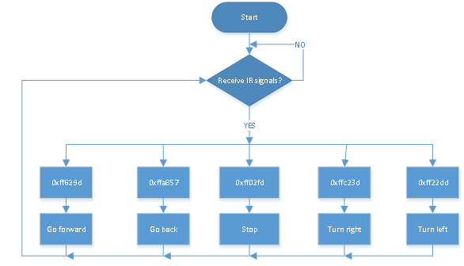 **(3)Схема підключення:**  Примітка: GND, VCC, SDA і SCL матриці світлодіодів 8x16 відповідно підключені до -(GND), + (VCC), SDA, SCL на платі розширення сенсорів V5. Виводи "-", "+" і S модуля інфрачервоного приймача відповідно підключені до G (GND), V (VCC) і A0 плати розширення Keyestudio. Коли цифрових портів недостатньо, аналоговий порт може використовуватися як цифровий порт. І аналоговий порт A0 еквівалентний цифровому порту 14, A1 еквівалентний цифровому порту 15 і так далі. **(4)Тестовий код** ```c++ /_ keyestudio Mini Tank Robot V3 урок 19 ІЧ дистанційний танк <http://www.keyestudio.com> _/ #include <IRremote.h> IRrecv irrecv(A2); // decode_results results; long ir_rec; //Використовується для зберігання отриманих інфрачервоних значень //Масив, використовується для збереження даних зображень, може бути розрахований самостійно або отриманий за допомогою інструменту модулювання unsigned char start01[] = {0x01, 0x02, 0x04, 0x08, 0x10, 0x20, 0x40, 0x80, 0x80, 0x40, 0x20, 0x10, 0x08, 0x04, 0x02, 0x01}; unsigned char front[] = {0x00, 0x00, 0x00, 0x00, 0x00, 0x24, 0x12, 0x09, 0x12, 0x24, 0x00, 0x00, 0x00, 0x00, 0x00, 0x00}; unsigned char back[] = {0x00, 0x00, 0x00, 0x00, 0x00, 0x24, 0x48, 0x90, 0x48, 0x24, 0x00, 0x00, 0x00, 0x00, 0x00, 0x00}; unsigned char left[] = {0x00, 0x00, 0x00, 0x00, 0x00, 0x00, 0x44, 0x28, 0x10, 0x44, 0x28, 0x10, 0x44, 0x28, 0x10, 0x00}; unsigned char right[] = {0x00, 0x10, 0x28, 0x44, 0x10, 0x28, 0x44, 0x10, 0x28, 0x44, 0x00, 0x00, 0x00, 0x00, 0x00, 0x00}; unsigned char STOP01[] = {0x2E, 0x2A, 0x3A, 0x00, 0x02, 0x3E, 0x02, 0x00, 0x3E, 0x22, 0x3E, 0x00, 0x3E, 0x0A, 0x0E, 0x00}; unsigned char clear[] = {0x00, 0x00, 0x00, 0x00, 0x00, 0x00, 0x00, 0x00, 0x00, 0x00, 0x00, 0x00, 0x00, 0x00, 0x00, 0x00}; #define SCL_Pin A5 //Встановити годинниковий пін як A5 #define SDA_Pin A4 //Встановити пін даних як A4 #define ML_Ctrl 4 //Визначити пін керування напрямком лівого двигуна #define ML_PWM 5 //Визначити пін керування ШІМ лівого двигуна #define MR_Ctrl 2 //Визначити пін керування напрямком правого двигуна #define MR_PWM 9 //Визначити пін керування ШІМ правого двигуна void setup() { Serial.begin(9600); irrecv.enableIRIn(); //Ініціалізувати бібліотеку інфрачервоного приймача pinMode(ML_Ctrl, OUTPUT); pinMode(ML_PWM, OUTPUT); pinMode(MR_Ctrl, OUTPUT); pinMode(MR_PWM, OUTPUT); pinMode(SCL_Pin, OUTPUT); pinMode(SDA_Pin, OUTPUT); matrix_display(clear); //Очистити екран matrix_display(start01); //Відобразити початковий малюнок } void loop() { if (irrecv.decode(&results)) { //Отримати значення інфрачервоного дистанційного керування ir_rec = results.value; String type = "UNKNOWN"; String typelist[14] = {"UNKNOWN", "NEC", "SONY", "RC5", "RC6", "DISH", "SHARP", "PANASONIC", "JVC", "SANYO", "MITSUBISHI", "SAMSUNG", "LG", "WHYNTER"}; if (results.decode_type >= 1 && results.decode_type <= 13) { type = typelist[results.decode_type]; } Serial.print("IR TYPE:" + type + " "); Serial.println(ir_rec, HEX); irrecv.resume(); } switch (ir_rec) { case 0xFF629D: Car_front(); break; //Наказати роботу рухатися вперед case 0xFFA857: Car_back(); break; //Наказати роботу рухатися назад case 0xFF22DD: Car_T_left(); break; //Наказати роботу повертати ліворуч case 0xFFC23D: Car_T_right(); break; //Наказати роботу повертати праворуч case 0xFF02FD: Car_Stop(); break; //Наказати роботу зупинитися case 0xFF30CF: Car_left(); break; //Наказати роботу обертатися ліворуч case 0xFF7A85: Car_right(); break; //Наказати роботу обертатися праворуч default: break; } } /****\*\*\*\*****Функція керування обертанням сервоприводу******\*\*\*******/ void Car_front() { digitalWrite(MR_Ctrl, LOW); analogWrite(MR_PWM, 200); digitalWrite(ML_Ctrl, LOW); analogWrite(ML_PWM, 200); matrix_display(front); //Відобразити малюнок руху вперед } void Car_back() { digitalWrite(MR_Ctrl, HIGH); analogWrite(MR_PWM, 200); digitalWrite(ML_Ctrl, HIGH); analogWrite(ML_PWM, 200); matrix_display(back); //Відобразити малюнок руху назад } void Car_left() { digitalWrite(MR_Ctrl, LOW); analogWrite(MR_PWM, 200); digitalWrite(ML_Ctrl, HIGH); analogWrite(ML_PWM, 200); matrix_display(left); //Відобразити малюнок обертання ліворуч } void Car_right() { digitalWrite(MR_Ctrl, HIGH); analogWrite(MR_PWM, 200); digitalWrite(ML_Ctrl, LOW); analogWrite(ML_PWM, 200); matrix_display(right); //Відобразити малюнок обертання праворуч } void Car_Stop() { digitalWrite(MR_Ctrl, LOW); analogWrite(MR_PWM, 0); digitalWrite(ML_Ctrl, LOW); analogWrite(ML_PWM, 0); matrix_display(STOP01); //Відобразити малюнок зупинки } void Car_T_left() { digitalWrite(MR_Ctrl, LOW); analogWrite(MR_PWM, 255); digitalWrite(ML_Ctrl, LOW); analogWrite(ML_PWM, 150); matrix_display(left);

```cpp
//Відображення шаблону повороту ліворуч
void Car_T_left() {
    digitalWrite(MR_Ctrl, LOW);
    analogWrite(MR_PWM, 255);
    digitalWrite(ML_Ctrl, LOW);
    analogWrite(ML_PWM, 150);
    matrix_display(left); //Відображення шаблону повороту ліворуч
}

void Car_T_right() {
    digitalWrite(MR_Ctrl, LOW);
    analogWrite(MR_PWM, 150);
    digitalWrite(ML_Ctrl, LOW);
    analogWrite(ML_PWM, 255);
    matrix_display(right); //Відображення шаблону повороту праворуч
}

//Ця функція використовується для відображення на точковій матриці
void matrix_display(unsigned char matrix_value[]) {
    IIC_start(); //Використовуйте функцію для початку передачі даних
    IIC_send(0xc0); //Вибір адреси
    for (int i = 0; i < 16; i++) //Дані шаблону мають 16 байт
    {
        IIC_send(matrix_value[i]); //Передача даних шаблону
    }
    IIC_end(); //Завершення передачі даних шаблону
    IIC_start();
    IIC_send(0x8A); //Контроль відображення, вибір 4/16 ширини імпульсу
    IIC_end();
}

//Умови для початку передачі даних
void IIC_start() {
    digitalWrite(SDA_Pin, HIGH);
    digitalWrite(SCL_Pin, HIGH);
    delayMicroseconds(3);
    digitalWrite(SDA_Pin, LOW);
    delayMicroseconds(3);
    digitalWrite(SCL_Pin, LOW);
}

//Сигнал завершення передачі даних
void IIC_end() {
    digitalWrite(SCL_Pin, LOW);
    digitalWrite(SDA_Pin, LOW);
    delayMicroseconds(3);
    digitalWrite(SCL_Pin, HIGH);
    delayMicroseconds(3);
    digitalWrite(SDA_Pin, HIGH);
    delayMicroseconds(3);
}

//Передача даних
void IIC_send(unsigned char send_data) {
    for (byte mask = 0x01; mask != 0; mask <<= 1) //Кожен байт має 8 біт, і перевірка починається з молодшого біта по одному біту
    {
        if (send_data & mask) {
            //Встановлення високого або низького рівня SDA_Pin залежно від того, чи кожен біт байта є 1 або 0
            digitalWrite(SDA_Pin, HIGH);
        } else {
            digitalWrite(SDA_Pin, LOW);
        }
        delayMicroseconds(3);
        digitalWrite(SCL_Pin, HIGH); //Підтягування піна годинника SCL_Pin для завершення передачі даних
        delayMicroseconds(3);
        digitalWrite(SCL_Pin, LOW); //Опускання піна годинника SCL_Pin для зміни сигналів SDA
    }
}
```

**(5) Результати тестування:**
Після успішного завантаження тестового коду та підключення живлення, смарт-кар можна керувати за допомогою ІЧ-пульта дистанційного керування, а 8\*16 відображає відповідні шаблони його рухів.

## **Проект 20: Bluetooth Control Tank**


**1. Опис:**
Ми вивчили базові знання про Bluetooth у попередньому проекті. У цьому уроці ми будемо використовувати Bluetooth для керування смарт-каром. Оскільки це включає Bluetooth, потрібні передавальний і приймальний кінці. У проекті ми використовуємо мобільний телефон як передавач (master), а смарт-кар, підключений до модуля Bluetooth HM-10 (slave), як приймач. Ми вже дізналися, що передача біта може керувати світлодіодами. І принцип керування цим роботом-танком такий самий. Для кращого керування інтелектуальним танковим роботом ми спеціально розробили додаток. У цьому уроці ми прочитаємо всі значення клавіш у цьому додатку за допомогою коду, а потім представимо ексклюзивний додаток для нашого танкового робота.

**2. Про додаток KeyesRobot**

**Інструкції для завантаження для системи Apple**
Відкрийте App Store→знайдіть KeyesRobot→завантажте його на свій телефон.


Відкрийте додаток Motorhome → з'явиться наступна сторінка → виберіть Tank Robot.


Увімкніть Bluetooth на мобільному телефоні → натисніть кнопку Bluetooth у верхньому правому куті цього додатку → знайдіть і спаріть їх. (Примітка: нам потрібно увімкнути дозвіл на місцезнаходження під час спарювання Bluetooth.)


Виберіть TANK ROBOT, і з'явиться наступна сторінка:


Використання цього додатку майже однакове для систем Apple і Android. І тут ми маємо намір взяти систему Android як приклад для пояснення, як правильно її використовувати.

**Інструкції для завантаження для системи Android**
Знайдіть KeyesRobot у Google Play або натисніть наступне посилання: https:/play.google.com/store/apps/details?id=com.keyestudio.keyestudio


Натисніть Увійти, щоб завантажити додаток


Наступна іконка означає успішну установку.


Натисніть іконку, щоб увійти в додаток і вибрати TANK ROBOT; Увімкніть дозвіл на "місцезнаходження та Bluetooth", потім підключіть і спаріть Bluetooth; Скануйте пристрої Bluetooth, і назва Bluetooth BLE 4.0 - HMSoft, який не має пароля для спарювання.


Після успішного завантаження тестового коду, підключення живлення та підключення до Bluetooth, світлодіод на модулі Bluetooth блимає; Натисніть іконку  і знайдіть Bluetooth, як показано нижче.


Натисніть підключити, і спарювання завершено, і світлодіод залишається увімкненим.

````
 Підключіть модуль Bluetooth і відкрийте серійний монітор, щоб встановити швидкість передачі даних на 9600; Натисніть кнопку в додатку Bluetooth, і відповідні символи відобразяться в серійному моніторі, як показано на зображенні нижче:  **3. Тестовий код 1** Тепер перейдемо до тестового коду. **(Примітка: Під час завантаження коду модуль Bluetooth повинен бути відключений, а після завершення завантаження Bluetooth можна знову підключити. Інакше код може не завантажитися, і нам також потрібно ввімкнути GPS, коли він підключений до Bluetooth.)** ```c++ /* keyestudio Mini Tank Robot v3.0 урок 20.1 тест Bluetooth http://www.keyestudio.com */ char ble_val; //Змінна символу (використовується для зберігання значення, отриманого через Bluetooth) void setup() { Serial.begin(9600); } void loop() { if(Serial.available() > 0) //Визначаємо, чи є дані в буфері серійного порту { ble_val = Serial.read(); //Читаємо дані з буфера серійного порту Serial.println(ble_val); //Друкуємо їх } } ``` Спочатку відключіть модуль Bluetooth і завантажте тестовий код; Потім знову підключіть модуль Bluetooth і відкрийте серійний монітор, щоб встановити швидкість передачі даних на 9600; Натисніть кнопку в додатку Bluetooth, і відповідні символи відобразяться в серійному моніторі, як показано на зображенні нижче:  Наступна таблиця ілюструє функції відповідних клавіш: <table> <tbody> <tr class="odd"> <td>Клавіші</td> <td>Функції</td> <td></td> </tr> <tr class="even"> <td> </td> <td>Підключити та з'єднати модуль HM-10 Bluetooth; натисніть ще раз, щоб відключити</td> <td></td> </tr> <tr class="odd"> <td> </td> <td>вибрати робот для управління</td> <td></td> </tr> <tr class="even"> <td> </td> <td>керувати рухами робота за допомогою кнопок</td> <td></td> </tr> <tr class="odd"> <td> </td> <td>Керувати рухами робота за допомогою джойстика</td> <td></td> </tr> <tr class="even"> <td> </td> <td>Керувати рухами робота за допомогою гравітації</td> <td></td> </tr> <tr class="odd"> <td> </td> <td>Надіслати “F” при натисканні і “S” при відпусканні</td> <td>Автомобіль рухається вперед при натисканні і зупиняється при відпусканні</td> </tr> <tr class="even"> <td> </td> <td>Надіслати “L” при натисканні і “S” при відпусканні</td> <td>Автомобіль повертає ліворуч при натисканні і зупиняється при відпусканні</td> </tr> <tr class="odd"> <td> </td> <td>Надіслати “R” при натисканні і “S” при відпусканні</td> <td>Автомобіль повертає праворуч при натисканні і зупиняється при відпусканні</td> </tr> <tr class="even"> <td> </td> <td>Надіслати “B” при натисканні і “S” при відпусканні</td> <td>Автомобіль повертає назад при натисканні і зупиняється при відпусканні</td> </tr> <tr class="odd"> <td> </td> <td>Надіслати “u”+цифра+“#” при перетягуванні</td> <td>Перетягування для зміни швидкості лівого двигуна</td> </tr> <tr class="even"> <td> </td> <td>Надіслати “v”+цифра+“#” при перетягуванні</td> <td>Перетягування для зміни швидкості правого двигуна</td> </tr> <tr class="odd"> <td> </td> <td>Вибрати для входу на сторінку функцій</td> <td></td> </tr> <tr class="even"> <td> </td> <td>Надіслати “G” при натисканні і “S” при повторному натисканні</td> <td>Ввійти в режим уникнення перешкод при натисканні і вийти при повторному натисканні</td> </tr> <tr class="odd"> <td> </td> <td>Надіслати “h” при натисканні і “S” при повторному натисканні</td> <td>Ввійти в режим слідування при натисканні і вийти при повторному натисканні</td> </tr> <tr class="even"> <td> </td> <td>Надіслати “e” при натисканні і “S” при повторному натисканні</td> <td>Ввійти в режим слідування лінії при натисканні і вийти при повторному натисканні</td> </tr> <tr class="odd"> <td> </td> <td>Надіслати “f” при натисканні і “S” при повторному натисканні</td> <td>Ввійти в режим руху в обмеженому просторі при натисканні і вийти при повторному натисканні</td> </tr> <tr class="even"> <td>
</td> <td>Надіслати “i” при натисканні і “S” при повторному натисканні</td> <td>Увійти в режим слідування за світлом при натисканні і вийти при повторному натисканні</td> </tr> <tr class="odd"> <td> </td> <td>Надіслати “j” при натисканні і “S” при повторному натисканні</td> <td>Увійти в режим гасіння вогню при натисканні і вийти при повторному натисканні</td> </tr> <tr class="even"> <td> </td> <td>Вибрати для входу в режим відображення виразу обличчя</td> <td></td> </tr> <tr class="odd"> <td> </td> <td>Надіслати “k” при натисканні і “z” при повторному натисканні</td> <td>Показати усміхнений візерунок при натисканні і очистити вираз при повторному натисканні</td> </tr> <tr class="even"> <td> </td> <td>Надіслати “l” при натисканні і “z” при повторному натисканні</td> <td>Показати огидний візерунок при натисканні і очистити вираз при повторному натисканні</td> </tr> <tr class="odd"> <td> </td> <td>Надіслати “m” при натисканні і “z” при повторному натисканні</td> <td>Показати щасливе обличчя при натисканні і очистити вираз при повторному натисканні</td> </tr> <tr class="even"> <td> </td> <td>Надіслати “n” при натисканні і “z” при повторному натисканні</td> <td>Показати сумний візерунок при натисканні і очистити вираз при повторному натисканні</td> </tr> <tr class="odd"> <td> </td> <td>Надіслати “o” при натисканні і “z” при повторному натисканні</td> <td>Показати зневажливий візерунок при натисканні і очистити вираз при повторному натисканні</td> </tr> <tr class="even"> <td> </td> <td>Надіслати “p” при натисканні і “z” при повторному натисканні</td> <td>Показати візерунок у формі серця при натисканні і очистити вираз при повторному натисканні</td> </tr> <tr class="odd"> <td> </td> <td>Вибрати для входу в інтерфейс користувацьких функцій; є шість клавіш 1,2,3,4,5,6; з цими клавішами ви можете розширити деякі функції самостійно</td> <td></td> </tr> <tr class="even"> <td> </td> <td>Натисніть, щоб надіслати “w”</td> <td>Натисніть, щоб відобразити аналогове значення, виявлене фоторезистором зліва</td> </tr> <tr class="odd"> <td> </td> <td>Натисніть, щоб надіслати “y”</td> <td>Натисніть, щоб відобразити аналогове значення, виявлене фоторезистором справа</td> </tr> <tr class="even"> <td> </td> <td>Натисніть, щоб надіслати “x”</td> <td>Натисніть, щоб показати відстань, виявлену ультразвуковим датчиком (одиниця: см)</td> </tr> <tr class="odd"> <td> </td> <td><p>Натисніть, щоб надіслати “c”</p> <p>Натисніть знову, щоб надіслати “d”</p></td> <td>Натисніть, щоб увімкнути вентилятор, і натисніть знову, щоб вимкнути його</td> </tr> </tbody> </table> **(4)Блок-схема**  **(5)Схема підключення:**  GND, VCC, SDA і SCL 8x16 світлодіодної матриці точок відповідно підключені до -(GND), + (VCC), SDA, SCL розширювальної плати; Модуль Bluetooth безпосередньо підключається до розширювальної плати. Будь ласка, зверніть увагу на напрямок контакту. Контакти STATE і BRK модуля Bluetooth не потрібно підключати. **(6)Тестовий код 2** (Примітка: під час завантаження коду модуль Bluetooth повинен бути відключений, і Bluetooth можна підключити знову після завершення завантаження. Інакше код може не бути завантажений.) ```c++ /* keyestudio Mini Tank Robot V3 урок 20.2 bluetooth tank http://www.keyestudio.com */ //Масив, використовується для збереження даних зображень, може бути розрахований самостійно або отриманий з інструменту модуляції unsigned char start01[] = {0x01, 0x02, 0x04, 0x08, 0x10, 0x20, 0x40, 0x80, 0x80, 0x40, 0x20, 0x10, 0x08, 0x04, 0x02, 0x01}; unsigned char front[] = {0x00, 0x00, 0x00, 0x00, 0x00, 0x24, 0x12, 0x09, 0x12, 0x24, 0x00, 0x00, 0x00, 0x00, 0x00, 0x00}; unsigned char back[] = {0x00, 0x00, 0x00, 0x00, 0x00, 0x24, 0x48, 0x90, 0x48, 0x24, 0x00, 0x00, 0x00, 0x00, 0x00, 0x00}; unsigned char left[] = {0x00, 0x00, 0x00, 0x00, 0x00, 0x00, 0x44, 0x28, 0x10, 0x44, 0x28, 0x10, 0x44, 0x28, 0x10, 0x00}; unsigned char right[] = {0x00, 0x10, 0x28, 0x44, 0x10, 0x28, 0x44, 0x10, 0x28, 0x44, 0x00, 0x00, 0x00, 0x00, 0x00, 0x00}; unsigned char STOP01[] = {0x2E, 0x2A, 0x3A, 0x00, 0x02, 0x3E, 0x02, 0x00, 0x3E, 0x22, 0x3E, 0x00, 0x3E, 0x0A, 0x0E, 0x00}; unsigned char clear[] = {0x00, 0x00, 0x00, 0x00, 0x00, 0x00, 0x00, 0x00, 0x00, 0x00,
```cpp
0x00, 0x00, 0x00, 0x00, 0x00, 0x00}; #define SCL_Pin A5 //Встановити контакт годинника як A5 #define SDA_Pin A4 //Встановити контакт даних як A4 #define ML_Ctrl 4 //Визначити контакт керування напрямком лівого двигуна #define ML_PWM 5 //Визначити контакт керування ШІМ лівого двигуна #define MR_Ctrl 2 //Визначити контакт керування напрямком правого двигуна #define MR_PWM 9 //Визначити контакт керування ШІМ правого двигуна char ble_val; //Використовується для зберігання значення, отриманого через Bluetooth void setup() { Serial.begin(9600); pinMode(ML_Ctrl, OUTPUT); pinMode(ML_PWM, OUTPUT); pinMode(MR_Ctrl, OUTPUT); pinMode(MR_PWM, OUTPUT); pinMode(SCL_Pin, OUTPUT); pinMode(SDA_Pin, OUTPUT); matrix_display(clear); //Очистити екран matrix_display(start01); //Відобразити початковий шаблон } void loop() { if (Serial.available()) { ble_val = Serial.read(); Serial.println(ble_val); } switch (ble_val) { case 'F': //Наказати роботу рухатися вперед Car_front(); break; case 'B': //Наказати роботу рухатися назад Car_back(); break; case 'L': //Наказати роботу повертати ліворуч Car_left(); break; case 'R': //Наказати роботу повертати праворуч Car_right(); break; case 'S': //Наказати роботу зупинитися Car_Stop(); break; } } /**********Функція керування обертанням сервоприводу***************/ void Car_front() { digitalWrite(MR_Ctrl, LOW); analogWrite(MR_PWM, 200); digitalWrite(ML_Ctrl, LOW); analogWrite(ML_PWM, 200); matrix_display(front); //Відобразити шаблон руху вперед } void Car_back() { digitalWrite(MR_Ctrl, HIGH); analogWrite(MR_PWM, 200); digitalWrite(ML_Ctrl, HIGH); analogWrite(ML_PWM, 200); matrix_display(back); //Відобразити шаблон руху назад } void Car_left() { digitalWrite(MR_Ctrl, LOW); analogWrite(MR_PWM, 200); digitalWrite(ML_Ctrl, HIGH); analogWrite(ML_PWM, 200); matrix_display(left); //Відобразити шаблон повороту ліворуч } void Car_right() { digitalWrite(MR_Ctrl, HIGH); analogWrite(MR_PWM, 200); digitalWrite(ML_Ctrl, LOW); analogWrite(ML_PWM, 200); matrix_display(right); //Відобразити шаблон повороту праворуч } void Car_Stop() { digitalWrite(MR_Ctrl, LOW); analogWrite(MR_PWM, 0); digitalWrite(ML_Ctrl, LOW); analogWrite(ML_PWM, 0); matrix_display(STOP01); //Відобразити шаблон зупинки } //Ця функція використовується для відображення на матричному дисплеї void matrix_display(unsigned char matrix_value[]) { IIC_start(); //Використовувати функцію для початку передачі даних IIC_send(0xc0); //Вибрати адресу for (int i = 0; i < 16; i++) //Дані шаблону мають 16 байтів { IIC_send(matrix_value[i]); //Передача даних шаблону } IIC_end(); //Завершити передачу даних шаблону IIC_start(); IIC_send(0x8A); //Керування відображенням, вибрати 4/16 ширину імпульсу IIC_end(); } //Умови для початку передачі даних void IIC_start() { digitalWrite(SDA_Pin, HIGH); digitalWrite(SCL_Pin, HIGH); delayMicroseconds(3); digitalWrite(SDA_Pin, LOW); delayMicroseconds(3); digitalWrite(SCL_Pin, LOW); } //Сигнал завершення передачі даних void IIC_end() { digitalWrite(SCL_Pin, LOW); digitalWrite(SDA_Pin, LOW); delayMicroseconds(3); digitalWrite(SCL_Pin, HIGH); delayMicroseconds(3); digitalWrite(SDA_Pin, HIGH); delayMicroseconds(3); } //Передача даних void IIC_send(unsigned char send_data) { for (byte mask = 0x01; mask != 0; mask <<= 1) //Кожен байт має 8 бітів, і перевірка починається з молодшого біта по одному біту { if (send_data & mask) { //Встановити високий або низький рівень SDA_Pin в залежності від того, чи є кожен біт байта 1 або 0 digitalWrite(SDA_Pin, HIGH); } else { digitalWrite(SDA_Pin, LOW); } delayMicroseconds(3); digitalWrite(SCL_Pin, HIGH); //Підняти контакт годинника SCL_Pin для завершення передачі даних delayMicroseconds(3); digitalWrite(SCL_Pin, LOW); //Опустити контакт годинника SCL_Pin для зміни сигналів SDA } } ``` **(7)Результати тестування:** Після успішного завантаження тестового коду, переведення DIP-перемикача в правий кінець, увімкнення живлення та спарювання додатку з Bluetooth, розумний автомобіль можна керувати за допомогою додатку.） ## **Проект 21: Танк з керуванням швидкістю через Bluetooth**  **(1)Опис:** У попередньому проекті ми навчилися керувати розумним танком за допомогою Bluetooth. Значення ШІМ двигуна, яке ми використовували раніше, було 200 (швидкість 200). У цьому уроці ми будемо використовувати Bluetooth для регулювання швидкості розумного автомобіля, але фіксована швидкість 200 не може бути змінена. Ми повинні визначити змінну speeds для зберігання значення швидкості. З попереднього навчання ми знаємо, що діапазон цього значення від 0 до 255. **(2)Блок-схема**  **(3)Схема підключення:**  GND, VCC, SDA і SCL 8x16 світлодіодної матриці відповідно
````

підключено до-(GND), + (VCC), SDA, SCL розширювальної плати; Модуль Bluetooth безпосередньо підключається до розширювальної плати. Будь ласка, зверніть увагу на напрямок піна. Піни STATE і BRK модуля Bluetooth не потрібно підключати. **(4)Тестовий код** (Примітка: Під час завантаження коду модуль Bluetooth повинен бути відключений, і Bluetooth можна підключити знову після завершення процесу завантаження. Інакше код може не завантажитися.) `c++ /* keyestudio Mini Tank Robot V3 урок 21 керування швидкістю танка через bluetooth http://www.keyestudio.com */ //Масив, використовується для збереження даних зображень, можна розрахувати самостійно або отримати за допомогою інструменту модуля unsigned char start01[] = {0x01, 0x02, 0x04, 0x08, 0x10, 0x20, 0x40, 0x80, 0x80, 0x40, 0x20, 0x10, 0x08, 0x04, 0x02, 0x01}; unsigned char front[] = {0x00, 0x00, 0x00, 0x00, 0x00, 0x24, 0x12, 0x09, 0x12, 0x24, 0x00, 0x00, 0x00, 0x00, 0x00, 0x00}; unsigned char back[] = {0x00, 0x00, 0x00, 0x00, 0x00, 0x24, 0x48, 0x90, 0x48, 0x24, 0x00, 0x00, 0x00, 0x00, 0x00, 0x00}; unsigned char left[] = {0x00, 0x00, 0x00, 0x00, 0x00, 0x00, 0x44, 0x28, 0x10, 0x44, 0x28, 0x10, 0x44, 0x28, 0x10, 0x00}; unsigned char right[] = {0x00, 0x10, 0x28, 0x44, 0x10, 0x28, 0x44, 0x10, 0x28, 0x44, 0x00, 0x00, 0x00, 0x00, 0x00, 0x00}; unsigned char STOP01[] = {0x2E, 0x2A, 0x3A, 0x00, 0x02, 0x3E, 0x02, 0x00, 0x3E, 0x22, 0x3E, 0x00, 0x3E, 0x0A, 0x0E, 0x00}; unsigned char clear[] = {0x00, 0x00, 0x00, 0x00, 0x00, 0x00, 0x00, 0x00, 0x00, 0x00, 0x00, 0x00, 0x00, 0x00, 0x00, 0x00}; unsigned char speed_a[] = {0x00, 0x00, 0x00, 0x20, 0x10, 0x08, 0x04, 0x02, 0xff, 0x02, 0x04, 0x08, 0x10, 0x20, 0x00, 0x00}; unsigned char speed_d[] = {0x00, 0x00, 0x00, 0x04, 0x08, 0x10, 0x20, 0x40, 0xff, 0x40, 0x20, 0x10, 0x08, 0x04, 0x00, 0x00}; #define SCL_Pin A5 //встановити пін годинника на A5 #define SDA_Pin A4 //A4 встановити пін даних на A4 #define ML_Ctrl 4 //визначити пін керування напрямком лівого двигуна #define ML_PWM 5 //визначити PWM пін керування лівого двигуна #define MR_Ctrl 2 //визначити пін керування напрямком правого двигуна #define MR_PWM 9 //визначити PWM пін керування правого двигуна char ble_val; //використовується для збереження значення з Bluetooth byte speeds = 200;;//початкова швидкість 200 void setup() { Serial.begin(9600); pinMode(ML_Ctrl, OUTPUT); pinMode(ML_PWM, OUTPUT); pinMode(MR_Ctrl, OUTPUT); pinMode(MR_PWM, OUTPUT); pinMode(SCL_Pin, OUTPUT); pinMode(SDA_Pin, OUTPUT); matrix_display(clear); //очистити екрани matrix_display(start01); //показати початкове зображення } void loop() { if (Serial.available() > 0) { ble_val = Serial.read(); Serial.println(ble_val); } switch (ble_val) { case 'F': //команда руху вперед Car_front(); break; case 'B': //команда руху назад Car_back(); break; case 'L': //команда повороту ліворуч Car_left(); break; case 'R': //команда повороту праворуч Car_right(); break; case 'S': //команда зупинки Car_Stop(); break; case 'Z': //збільшення швидкості speeds_a(); break; case 'X': //зменшення швидкості speeds_d(); break; } } /***************робота двигуна***************/ void Car_front() { digitalWrite(MR_Ctrl, LOW); analogWrite(MR_PWM, speeds); digitalWrite(ML_Ctrl, LOW); analogWrite(ML_PWM, speeds); matrix_display(front); //показати зображення руху вперед } void Car_back() { digitalWrite(MR_Ctrl, HIGH); analogWrite(MR_PWM, speeds); digitalWrite(ML_Ctrl, HIGH); analogWrite(ML_PWM, speeds); matrix_display(back); //показати зображення руху назад } void Car_left() { digitalWrite(MR_Ctrl, LOW); analogWrite(MR_PWM, speeds); digitalWrite(ML_Ctrl, HIGH); analogWrite(ML_PWM, speeds); matrix_display(left); //показати зображення повороту проти годинникової стрілки } void Car_right() { digitalWrite(MR_Ctrl, HIGH); analogWrite(MR_PWM, speeds); digitalWrite(ML_Ctrl, LOW); analogWrite(ML_PWM, speeds); matrix_display(right); //показати зображення повороту за годинниковою стрілкою } void Car_Stop() { digitalWrite(MR_Ctrl, LOW); analogWrite(MR_PWM, 0); digitalWrite(ML_Ctrl, LOW); analogWrite(ML_PWM, 0); matrix_display(STOP01); //показати зображення зупинки } void Car_T_left() { digitalWrite(MR_Ctrl, LOW); analogWrite(MR_PWM, 255); digitalWrite(ML_Ctrl, LOW); analogWrite(ML_PWM, 150); matrix_display(left); //показати зображення повороту ліворуч } void Car_T_right() { digitalWrite(MR_Ctrl, LOW); analogWrite(MR_PWM, 150); digitalWrite(ML_Ctrl, LOW); analogWrite(ML_PWM, 255); matrix_display(right); //показати зображення повороту праворуч } void speeds_a() { //Функція прискорення matrix_display(speed_a); //показати зображення збільшення швидкості while (1) { Serial.println(speeds); //показати швидкість if (speeds < 255) { //збільшити до 255 speeds++; delay(10); //регулювання швидкості } ble_val = Serial.read(); if (ble_val == 'S')break; //отримати ‘S’ для зупинки
прискорення } } void speeds_d() { //Функція уповільнення matrix_display(speed_d); //показати зображення уповільнення while (1) { Serial.println(speeds); //показати швидкість if (speeds > 0) { //зменшити до 0 speeds--; delay(10); //налаштувати швидкість } ble_val = Serial.read(); if (ble_val == 'S') break; //отримати ‘S’ і зупинити прискорення } } //ця функція використовується для відображення матриці точок void matrix_display(unsigned char matrix_value[]) { IIC_start(); //використовувати функцію для початку передачі даних IIC_send(0xc0); //вибрати адресу for (int i = 0; i < 16; i++) //дані зображення мають 16 символів { IIC_send(matrix_value[i]); //дані для передачі зображень } IIC_end(); //закінчити передачу даних зображень IIC_start(); IIC_send(0x8A); //показати контроль і вибрати ширину імпульсу 4/16 IIC_end(); } //умова, коли дані починають передаватися void IIC_start() { digitalWrite(SDA_Pin, HIGH); digitalWrite(SCL_Pin, HIGH); delayMicroseconds(3); digitalWrite(SDA_Pin, LOW); delayMicroseconds(3); digitalWrite(SCL_Pin, LOW); } //ознака завершення передачі даних void IIC_end() { digitalWrite(SCL_Pin, LOW); digitalWrite(SDA_Pin, LOW); delayMicroseconds(3); digitalWrite(SCL_Pin, HIGH); delayMicroseconds(3); digitalWrite(SDA_Pin, HIGH); delayMicroseconds(3); } //передача даних void IIC_send(unsigned char send_data) { for (byte mask = 0x01; mask != 0; mask <<= 1) //кожен символ має 8 цифр, які перевіряються по черзі { if (send_data & mask) { //встановити високий або низький рівень відповідно до кожного біта (0 або 1) digitalWrite(SDA_Pin, HIGH); } else { digitalWrite(SDA_Pin, LOW); } delayMicroseconds(3); digitalWrite(SCL_Pin, HIGH); //підняти контакт годинника SCL_Pin для завершення передачі даних delayMicroseconds(3); digitalWrite(SCL_Pin, LOW); //опустити контакт годинника SCL_Pin для зміни сигналів SDA } }` **(5)Результати тестування:** Після успішного завантаження тестового коду, перемикання DIP-перемикача в крайнє праве положення, увімкнення живлення та спарювання додатку з Bluetooth, розумний автомобіль можна керувати за допомогою додатку. Швидкість автомобіля можна регулювати, переміщуючи регулятори швидкості лівого та правого моторів. (Ви можете звернутися до таблиці функцій у проекті 20 для допомоги) ## **Проект 22: Багатофункціональний танк**  **(1)Опис:** Розумний автомобіль виконував одну функцію в кожному попередньому проекті. Чи може він відображати кілька функцій одночасно? Так. У цьому останньому великому проекті ми маємо намір використовувати повний код для керування розумним автомобілем, щоб продемонструвати всі функції, згадані в попередніх проектах. Ми використовуємо клавіші на Bluetooth додатку для автоматичного перемикання різних функцій, що дуже просто та зручно. **(2)Блок-схема**  **(3)Схема підключення:**  Будь ласка, ретельно перевірте проводку. Коли ми хочемо показати функцію гасіння вогню цього автомобіля, нам потрібно від'єднати ультразвуковий датчик, сервопривід і фоточутливий датчик від нього та замінити їх на модуль вентилятора і датчик полум'я; 1. GND, VCC, SDA і SCL 1.8x16 світлодіодної матриці точок відповідно підключаються до-(GND), + (VCC), SDA, SCL розширювальної плати; 2. Контакт VCC ультразвукового датчика (модуль вентилятора) підключається до 5v(V), контакт Trig до цифрового 12(S), контакт Echo до цифрового 13(S), а контакт Gnd до Gnd(G); 3. Сервопривід підключається до G, V і 10. Коричневий провід сервоприводу підключається до Gnd (G), червоний провід підключається до 5v (V), а оранжевий провід підключається до 10; 4. RXD, TXD, GND і VCC модуля Bluetooth відповідно підключаються до TX, RX,-(GND), + (VCC), а контакти STATE і BRK модуля Bluetooth не потрібно підключати; 5. Контакти "-", "+" і S модуля інфрачервоного приймача відповідно підключаються до сенсорної розширювальної плати G (GND), V (VCC), A2 за допомогою проводів; 6. Контакти "-" "+" і S лівого модуля фоторезистора (датчик полум'я) відповідно підключаються до G (GND), V (VCC), A0 розширювальної плати, а для правого модуля фоторезистора (датчик полум'я) вони підключаються до G (GND), V (VCC), A1. 7. Датчик лінійного відстеження підключається до цифрових контактів 6, 7 і 8. **(4)Тестовий код** ```c++ /_keyestudio Mini Tank Robot V3 урок 22 множинні функції <http://www.keyestudio.com> _/ #include <IRremote.h> IRrecv irrecv(A2); // decode_results results; long ir_rec; //використовується для збереження значення ІЧ //Масив, використовується для збереження даних зображень, може бути розрахований самостійно або отриманий з інструменту модуля unsigned char start01[] = {0x01, 0x02, 0x04, 0x08, 0x10, 0x20, 0x40, 0x80, 0x80, 0x40, 0x20, 0x10, 0x08, 0x04, 0x02, 0x01}; unsigned char STOP01[] = {0x2E, 0x2A, 0x3A, 0x00, 0x02, 0x3E, 0x02, 0x00, 0x3E, 0x22, 0x3E, 0x00, 0x3E, 0x0A, 0x0E, 0x00}; unsigned char front[] = {0x00,
0x00, 0x00, 0x00, 0x00, 0x24, 0x12, 0x09, 0x12, 0x24, 0x00, 0x00, 0x00, 0x00, 0x00, 0x00}; unsigned char back[] = {0x00, 0x00, 0x00, 0x00, 0x00, 0x24, 0x48, 0x90, 0x48, 0x24, 0x00, 0x00, 0x00, 0x00, 0x00, 0x00}; unsigned char left[] = {0x00, 0x00, 0x00, 0x00, 0x00, 0x00, 0x44, 0x28, 0x10, 0x44, 0x28, 0x10, 0x44, 0x28, 0x10, 0x00}; unsigned char right[] = {0x00, 0x10, 0x28, 0x44, 0x10, 0x28, 0x44, 0x10, 0x28, 0x44, 0x00, 0x00, 0x00, 0x00, 0x00}; unsigned char Smile[] = {0x00, 0x00, 0x1c, 0x02, 0x02, 0x02, 0x5c, 0x40, 0x40, 0x5c, 0x02, 0x02, 0x02, 0x1c, 0x00, 0x00}; unsigned char Disgust[] = {0x00, 0x00, 0x02, 0x02, 0x02, 0x12, 0x08, 0x04, 0x08, 0x12, 0x22, 0x02, 0x02, 0x00, 0x00, 0x00}; unsigned char Happy[] = {0x02, 0x02, 0x02, 0x02, 0x08, 0x18, 0x28, 0x48, 0x28, 0x18, 0x08, 0x02, 0x02, 0x02, 0x02, 0x00}; unsigned char Squint[] = {0x00, 0x00, 0x00, 0x41, 0x22, 0x14, 0x48, 0x40, 0x40, 0x48, 0x14, 0x22, 0x41, 0x00, 0x00, 0x00}; unsigned char Despise[] = {0x00, 0x00, 0x06, 0x04, 0x04, 0x04, 0x24, 0x20, 0x20, 0x26, 0x04, 0x04, 0x04, 0x04, 0x00, 0x00}; unsigned char Heart[] = {0x00, 0x00, 0x0C, 0x1E, 0x3F, 0x7F, 0xFE, 0xFC, 0xFE, 0x7F, 0x3F, 0x1E, 0x0C, 0x00, 0x00, 0x00}; unsigned char clear[] = {0x00, 0x00, 0x00, 0x00, 0x00, 0x00, 0x00, 0x00, 0x00, 0x00, 0x00, 0x00, 0x00, 0x00, 0x00, 0x00}; #define SCL_Pin A5 //встановити контакт годинника на A5 #define SDA_Pin A4 //встановити контакт даних на A4 #define ML_Ctrl 4 //визначити контакт керування напрямком лівого двигуна як 4 #define ML_PWM 5 //визначити контакт керування PWM лівого двигуна як 5 #define MR_Ctrl 2 //визначити контакт керування напрямком правого сенсора як 2 #define MR_PWM 9 //визначити контакт керування PWM правого двигуна як 9 char ble_val; //використовується для збереження значення Bluetooth byte speeds_L = 200; //початкова швидкість лівого двигуна 200 byte speeds_R = 200; //початкова швидкість правого двигуна 200 String speeds_l, speeds_r; //отримати символи PWM і перетворити їх у значення PWM //#define light_L_Pin A0 //визначити контакт лівого фоторезистора //#define light_R_Pin A1 //визначити контакт правого фоторезистора int left_light; int right_light; int flame_L = A0; //визначити аналоговий порт лівого сенсора полум'я як A0 int flame_R = A1; //визначити аналоговий порт правого сенсора полум'я як A1 //підключити сенсор лінійного відстеження #define L_pin 6 //ліворуч #define M_pin 7 //посередині #define R_pin 8 //праворуч int L_val, M_val, R_val, flame_valL, flame_valR; //контакт двигуна 130 int INA = 12; int INB = 13; //#define Trig 12 //#define Echo 13 float distance; //Зберегти значення відстані, виявлені ультразвуковим сенсором для подальшого використання //Зберегти значення відстані, виявлені ультразвуковим сенсором для уникнення перешкод int a; int a1; int a2; #define servoPin 10 //контакт сервоприводу bool flag; // інваріантний прапорець, що використовується для входу та виходу з режиму void setup() { Serial.begin(9600); irrecv.enableIRIn(); //Ініціалізувати бібліотеку ІЧ-пульта // pinMode(light_L_Pin, INPUT); // pinMode(light_R_Pin, INPUT); //визначити контакти сенсорів як INPUT pinMode(flame_L, INPUT); pinMode(flame_R, INPUT); // pinMode(Trig, OUTPUT); // pinMode(Echo, INPUT); pinMode(ML_Ctrl, OUTPUT); pinMode(ML_PWM, OUTPUT); pinMode(MR_Ctrl, OUTPUT); pinMode(MR_PWM, OUTPUT); pinMode(L_pin, INPUT); //встановити контакти сенсора лінійного відстеження як INPUT pinMode(M_pin, INPUT); pinMode(R_pin, INPUT); pinMode(servoPin, OUTPUT); pinMode(SCL_Pin, OUTPUT); pinMode(SDA_Pin, OUTPUT); pinMode(INA, OUTPUT); //встановити INA як OUTPUT pinMode(INB, OUTPUT); //встановити INB як OUTPUT matrix_display(clear); //очистити екрани matrix_display(start01); //показати початкову процедуру(90); //встановити кут сервоприводу на 90° } void loop() { if (Serial.available()) //якщо в буфері серійного порту є дані { ble_val = Serial.read(); Serial.println(ble_val); switch (ble_val) { case 'F': Car_front(); break; //команда для руху вперед case 'B': Car_back(); break; //команда для руху назад case 'L': Car_left(); break; //команда для повороту ліворуч case 'R': Car_right(); break; //команда для повороту праворуч case 'S': Car_Stop(); break; //команда для зупинки case 'e': Tracking(); break; //вхід у режим лінійного відстеження case 'f': Confinement(); break; //вхід у режим обмеження // case 'g': Avoid(); break; //вхід у режим уникнення перешкод // case 'h': Follow(); break; //вхід у режим лінійного відстеження // case 'i': Light_following(); break; //вхід у режим слідування за світлом case 'j': Fire(); break; //вхід у режим гасіння вогню case 'c': fan_begin(); break; //запуск вентилятора case 'd': fan_stop(); break; //вимкнення вентилятора case 'u': speeds_l = Serial.readStringUntil('#'); speeds_L = String(speeds_l).toInt(); break; //початок прийому з 'u', кінець прийому символів '#' і перетворення в ціле число case 'v': speeds_r = Serial.readStringUntil('#');
швидкість_R = String(speeds_r).toInt(); break; //почати з отримання u, закінчити отриманням символів # і перетворити у ціле число case 'k': matrix_display(Smile); break; //показати "усмішку" case 'l': matrix_display(Disgust); break; //показати "відразу" case 'm': matrix_display(Happy); break; //показати "щасливе" обличчя case 'n': matrix_display(Squint); break; //показати "сумне" обличчя case 'o': matrix_display(Despise); break; //показати "презирство" case 'p': matrix_display(Heart); break; //показати зображення серця case 'z': matrix_display(clear); break; //очистити зображення default: break; } } //наступні сигнали використовуються для виводу /_if(ble_val == 'x'){ distance = checkdistance(); Serial.println(distance); delay(50); }else if(ble_val == 'w'){ left_light = analogRead(light_L_Pin); Serial.println(left_light); delay(50); }else if(ble_val == 'y'){ right_light = analogRead(light_R_Pin); Serial.println(right_light); delay(50); }_/ if (irrecv.decode(&results)) { //отримання значення, виявленого ІЧ-пультом ir_rec = results.value; Serial.println(ir_rec, HEX); switch (ir_rec) { case 0xFF629D: Car_front(); break; //команда руху вперед case 0xFFA857: Car_back(); break; //команда руху назад case 0xFF22DD: Car_left(); break; //команда повороту ліворуч case 0xFFC23D: Car_right(); break; //команда повороту праворуч case 0xFF02FD: Car_Stop(); break; //команда зупинки default: break; } irrecv.resume(); } } /********\*********уникнення перешкод********\*\*********/ /_void Avoid() { flag = 0; while (flag == 0) { a = checkdistance(); //встановити відстань спереду, виявлену ультразвуковим датчиком, на a if (a < 20) {//коли відстань спереду менше 20см Car_Stop(); //робот зупиняється delay(500); //затримка на 500мс procedure(180); //платформа сервоприводу повертається ліворуч delay(500); //затримка на 500мс a1 = checkdistance(); //встановити відстань ліворуч, виявлену ультразвуковим датчиком, на a1 delay(100); //читання значення procedure(0); //платформа сервоприводу повертається праворуч delay(500); //затримка на 500мс a2 = checkdistance(); //встановити відстань праворуч, виявлену ультразвуковим датчиком, на a2 delay(100); //читання значення procedure(90); //повернення на 90° delay(500); if (a1 > a2) { //відстань ліворуч більша за відстань праворуч Car_left(); //робот повертає ліворуч delay(700); //поворот ліворуч на 700мс } else { Car_right(); //робот повертає праворуч delay(700); } } else { //якщо відстань спереду ≥20см, робот рухається вперед Car_front(); //рух вперед } // отримання значення Bluetooth для виходу з циклу if (Serial.available()) { ble_val = Serial.read(); if (ble_val == 'S') //отримання S { flag = 1; //встановити прапорець на 1, вихід з циклу Car_Stop(); } } } }_/ /********\*\*\*********слідкування за лінією******\*\*\*\*******/ /_void Follow() { flag = 0; while (flag == 0) { distance = checkdistance(); //встановити значення відстані на distance if (distance >= 20 && distance <= 60) //20≤ відстань ≤60, рух вперед { Car_front(); } else if (distance > 10 && distance < 20) //10＜ відстань < 20, зупинка { Car_Stop(); } else if (distance <= 10) //відстань≤ 10, рух назад { Car_back(); } else //або інше, зупинка { Car_Stop(); } if (Serial.available()) { ble_val = Serial.read(); if (ble_val == 'S') { flag = 1; //вихід з циклу Car_Stop(); } } } }_/ /******\*\*\*\*******слідкування за світлом********\*\*********/ /_void Light_following() { flag = 0; while (flag == 0) { left_light = analogRead(light_L_Pin); right_light = analogRead(light_R_Pin); if (left_light > 650 && right_light > 650) //рух вперед { Car_front(); } else if (left_light > 650 && right_light <= 650) //поворот ліворуч { Car_left(); } else if (left_light <= 650 && right_light > 650) //поворот праворуч { Car_right(); } else //або інше, зупинка { Car_Stop(); } if (Serial.available()) { ble_val = Serial.read(); if (ble_val == 'S') { flag = 1; Car_Stop(); } } } }_/ /******\*\*\*******гасіння вогню********\*********/ void Fire() { flag = 0; while (flag == 0) { //читання аналогового значення датчика полум'я flame_valL = analogRead(flame_L); flame_valR = analogRead(flame_R); if (flame_valL <= 700 || flame_valR <= 700) { Car_Stop(); fan_begin(); } else { fan_stop(); L_val = digitalRead(L_pin); //читання значення лівого датчика M_val = digitalRead(M_pin); //читання значення середнього датчика R_val = digitalRead(R_pin); //читання значення правого датчика if (M_val == 1) { //середній датчик виявляє чорні лінії if (L_val == 1 && R_val == 0) { //якщо тільки лівий датчик виявляє чорні лінії, поворот ліворуч Car_left(); } else if (L_val == 0 && R_val == 1) { //якщо тільки правий датчик виявляє чорні лінії, поворот праворуч Car_right(); } else { //рух вперед в іншому випадку Car_front(); } } else { //середній датчик не виявляє чорні лінії if (L_val == 1 && R_val == 0) { //якщо тільки лівий датчик виявляє чорні лінії, поворот ліворуч Car_left(); } else if (L_val == 0 && R_val == 1) { //якщо тільки правий датчик виявляє чорні лінії, поворот праворуч Car_right(); } else { //рух вперед в іншому випадку Car_front(); } } } } }

```cpp
right Car_right(); } else { //stop otherwise Car_Stop(); } } } if (Serial.available()) { ble_val = Serial.read(); if (ble_val == 'S') { flag = 1; Car_Stop(); } } } } /***************слідування лінії*****************/ void Tracking() { flag = 0; while (flag == 0) { L_val = digitalRead(L_pin); //зчитати значення лівого сенсора M_val = digitalRead(M_pin); //зчитати значення середнього сенсора R_val = digitalRead(R_pin); //зчитати значення правого сенсора if (M_val == 1) { //середній сенсор виявляє чорні лінії if (L_val == 1 && R_val == 0) { //якщо тільки лівий сенсор виявляє чорні лінії, повернути ліворуч Car_left(); } else if (L_val == 0 && R_val == 1) { //якщо тільки правий сенсор виявляє чорні лінії, повернути праворуч Car_right(); } else { //інакше, рухатися вперед Car_front(); } } else { //середній сенсор не виявляє чорну лінію if (L_val == 1 && R_val == 0) { //якщо тільки лівий сенсор виявляє чорну лінію, повернути ліворуч Car_left(); } else if (L_val == 0 && R_val == 1) { //якщо тільки правий сенсор виявляє чорні лінії, повернути праворуч Car_right(); } else { //інакше, зупинитися Car_Stop(); } } if (Serial.available()) { ble_val = Serial.read(); if (ble_val == 'S') { flag = 1; Car_Stop(); } } } } /***************обмеження*****************/ void Confinement() { flag = 0; while (flag == 0) { L_val = digitalRead(L_pin); //зчитати значення лівого сенсора M_val = digitalRead(M_pin); //зчитати значення середнього сенсора R_val = digitalRead(R_pin); //зчитати значення правого сенсора if ( L_val == 0 && M_val == 0 && R_val == 0 ) { //якщо жоден сенсор не виявляє чорні лінії, рухатися вперед Car_front(); } else { //інакше, будь-який сенсор слідування лінії може рухатися назад і повертати ліворуч Car_back(); delay(700); Car_left(); delay(800); } if (Serial.available()) { ble_val = Serial.read(); if (ble_val == 'S') { flag = 1; Car_Stop(); } } } } //функція для контролю ультразвукового сенсора /*float checkdistance() { float distance; digitalWrite(Trig, LOW); delayMicroseconds(2); digitalWrite(Trig, HIGH); delayMicroseconds(10); digitalWrite(Trig, LOW); distance = pulseIn(Echo, HIGH) / 58.20; // 2*29.1=58.2 delay(10); return distance; }*/ //функція для контролю сервоприводу void procedure(int myangle) { int pulsewidth; pulsewidth = map(myangle, 0, 180, 500, 2000); //обчислити значення ширини імпульсу for (int i = 0; i < 5; i++) { digitalWrite(servoPin, HIGH); delayMicroseconds(pulsewidth); //час, протягом якого високий рівень підтримується, це ширина імпульсу digitalWrite(servoPin, LOW); delay((20 - pulsewidth / 1000)); //Цикл становить 20мс } } /***************вентилятор обертається*****************/ void fan_begin() { digitalWrite(INA, LOW); digitalWrite(INB, HIGH); } /***************вентилятор зупиняється*****************/ void fan_stop() { digitalWrite(INA, LOW); digitalWrite(INB, LOW); } /***************точкова матриця*****************/ ///ця функція використовується для відображення точкової матриці void matrix_display(unsigned char matrix_value[]) { IIC_start(); //використовувати функцію для початку передачі даних IIC_send(0xc0); //вибрати адресу for (int i = 0; i < 16; i++) //дані зображення мають 16 символів { IIC_send(matrix_value[i]); //дані для передачі зображень } IIC_end(); //закінчити передачу даних зображень IIC_start(); IIC_send(0x8A); //показати управління і вибрати ширину імпульсу 4/16 IIC_end(); } //умова, що дані починають передаватися void IIC_start() { digitalWrite(SDA_Pin, HIGH); digitalWrite(SCL_Pin, HIGH); delayMicroseconds(3); digitalWrite(SDA_Pin, LOW); delayMicroseconds(3); digitalWrite(SCL_Pin, LOW); } //передача даних void IIC_send(unsigned char send_data) { for (byte mask = 0x01; mask != 0; mask <<= 1) //кожен символ має 8 цифр, які перевіряються по черзі { if (send_data & mask) { //встановити високий або низький рівень відповідно до кожного біта (0 або 1) digitalWrite(SDA_Pin, HIGH); } else { digitalWrite(SDA_Pin, LOW); } delayMicroseconds(3); digitalWrite(SCL_Pin, HIGH); //підняти контакт годинника SCL_Pin, щоб завершити передачу даних delayMicroseconds(3); digitalWrite(SCL_Pin, LOW); //опустити контакт годинника SCL_Pin, щоб змінити сигнали SDA } } //ознака, що передача даних закінчена void IIC_end() { digitalWrite(SCL_Pin, LOW); digitalWrite(SDA_Pin, LOW); delayMicroseconds(3); digitalWrite(SCL_Pin, HIGH); delayMicroseconds(3); digitalWrite(SDA_Pin, HIGH); delayMicroseconds(3); } /***************мотор працює***************/ void Car_front() { digitalWrite(MR_Ctrl, LOW); analogWrite(MR_PWM, speeds_R); digitalWrite(ML_Ctrl, LOW); analogWrite(ML_PWM, speeds_L); matrix_display(front); //показати зображення руху вперед } void Car_back() { digitalWrite(MR_Ctrl, HIGH); analogWrite(MR_PWM, speeds_R); digitalWrite(ML_Ctrl, HIGH); analogWrite(ML_PWM, speeds_L); matrix_display(back); //показати зображення руху назад } void Car_left() {
```

```cpp
digitalWrite(MR_Ctrl, LOW);
analogWrite(MR_PWM, speeds_R);
digitalWrite(ML_Ctrl, HIGH);
analogWrite(ML_PWM, speeds_L);
matrix_display(left); // показати зображення повороту ліворуч
}
void Car_right() {
digitalWrite(MR_Ctrl, HIGH);
analogWrite(MR_PWM, speeds_R);
digitalWrite(ML_Ctrl, LOW);
analogWrite(ML_PWM, speeds_L);
matrix_display(right); // показати зображення повороту праворуч
}
void Car_Stop() {
digitalWrite(MR_Ctrl, LOW);
analogWrite(MR_PWM, 0);
digitalWrite(ML_Ctrl, LOW);
analogWrite(ML_PWM, 0);
matrix_display(STOP01); // показати зображення зупинки
}
```

**(5) Результати тестування:**
(Примітка: перед завантаженням тестового коду необхідно видалити модуль Bluetooth. Інакше код не завантажиться. Коли процес завантаження коду завершено, увімкніть GPS на вашому телефоні, а потім знову підключіть модуль Bluetooth.)

Після успішного завантаження тестового коду, увімкнення живлення та спарювання додатка з Bluetooth, розумний автомобіль можна керувати за допомогою додатка для виконання різних функцій. Ми можемо реалізувати відповідні функції, натискаючи відповідні клавіші для вибору різних режимів, і нарешті завершити роботу розумного автомобіля клавішею Stop.

На наведеній вище схемі підключення немає модуля вентилятора та модуля датчика полум'я. Коли ми демонструємо функцію гасіння вогню автомобіля, нам потрібно замінити сервопривід, ультразвуковий датчик і фоторезистор на модуль вентилятора та модуль полум'я. Звичайно, в цей час ми не можемо увійти в режими прямолінійного слідування, ультразвукового уникнення перешкод та пошуку світла. Однак ми використовуємо контакти для фіксації датчиків і модулів, що робить від'єднання та збірку дуже простими. Не турбуйтеся про це. Але нам потрібно заблокувати невикористаний код для деяких модулів, що використовують той самий IO порт. Модуль вентилятора та модуль датчика полум'я в наведеному вище коді заблоковані.

Всі проекти завершені. Сподіваємося, ви отримали нові знання. Якщо у вас виникли проблеми з цим набором, будь ласка, звертайтеся до наших професіоналів служби підтримки клієнтів, які допоможуть вам вчасно.
